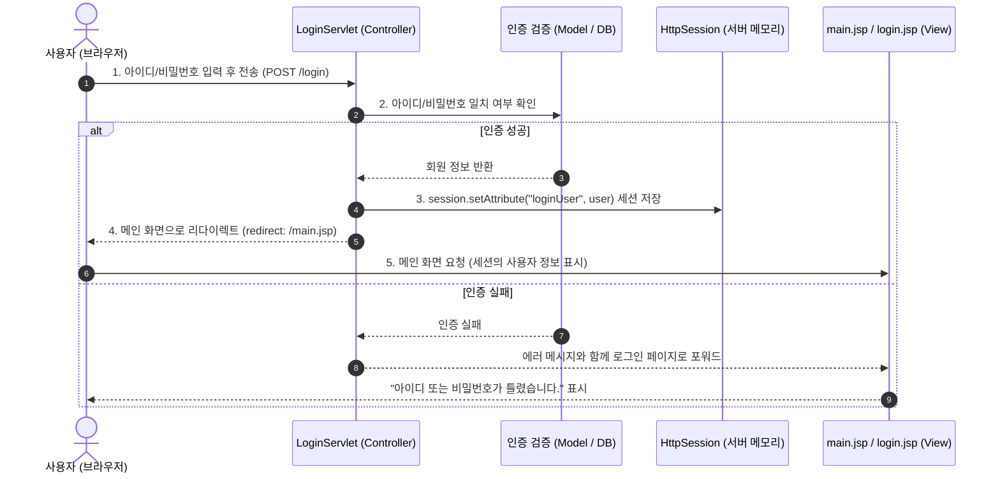

# JSP & Servlet 로그인 구현 단계별 실습 가이드

이 문서는 **Servlet과 JSP를 활용하여 로그인/로그아웃 기능을 처음부터 끝까지 단계별로 직접 구현해보는 가이드**입니다.  
현재 프로젝트(`Survlet_practice`)의 환경(Jakarta EE, Tomcat 10+, Gradle)에 맞추어 바로 적용할 수 있도록 작성되었습니다.

---

## 📌 목차
1. [로그인 동작 원리 및 전체 흐름](#1-로그인-동작-원리-및-전체-흐름)
2. [프로젝트 구조 및 파일 배치도](#2-프로젝트-구조-및-파일-배치도)
3. [Step 1: 사용자 모델(DTO) 정의](#step-1-사용자-모델dto-정의)
4. [Step 2: 로그인 폼 화면(JSP) 작성](#step-2-로그인-폼-화면jsp-작성)
5. [Step 3: 로그인 처리 서블릿(LoginServlet) 작성](#step-3-로그인-처리-서블릿loginservlet-작성)
6. [Step 4: 로그인 성공 및 메인 화면(JSP) 작성](#step-4-로그인-성공-및-메인-화면jsp-작성)
7. [Step 5: 로그아웃 처리 서블릿(LogoutServlet) 작성](#step-5-로그아웃-처리-서블릿logoutservlet-작성)
8. [Step 6: 실행 및 동작 테스트](#step-6-실행-및-동작-테스트)
9. [Step 7: 한 걸음 더 나아가기 (DB 연동 DAO & 인증 필터)](#step-7-한-걸음-더-나아가기-db-연동-dao--인증-필터)
10. [자주 발생하는 오류 & 체크리스트 (FAQ)](#자주-발생하는-오류--체크리스트-faq)

---

## 1. 로그인 동작 원리 및 전체 흐름

HTTP 프로토콜은 **Stateless(무상태성)** 특성을 가집니다. 즉, 클라이언트(브라우저)와 서버 간의 요청/응답이 끝나면 연결이 끊어지고 이전 상태를 기억하지 못합니다.  
따라서 "누가 로그인되어 있는가?"를 유지하기 위해 서버 측 메모리에 정보를 저장하는 **세션(HttpSession)** 기술을 사용합니다.



---

## 2. 프로젝트 구조 및 파일 배치도

현재 프로젝트(`com.kyobo.web` 패키지) 기준 생성할 파일 위치입니다.

```text
Survlet_practice/
 └── src/
      └── main/
           ├── java/
           │    └── com/kyobo/web/
           │         ├── controller/
           │         │    ├── HelloServlet.java      (기존 파일)
           │         │    ├── LoginServlet.java      [신규 작성 - 로그인 Controller]
           │         │    └── LogoutServlet.java     [신규 작성 - 로그아웃 Controller]
           │         └── model/
           │              └── Member.java            [신규 작성 - 사용자 정보 DTO]
           └── webapp/
                ├── WEB-INF/
                │    └── views/
                │         └── login.jsp              [신규 작성 - 로그인 화면]
                ├── index.html                       (기존 파일)
                └── main.jsp                         [신규 작성 - 로그인 후 메인 화면]
```

> **주의 (Jakarta EE 네임스페이스)**  
> 현재 프로젝트는 Servlet API 6.1.0을 사용하므로 `javax.servlet.*` 대신 **`jakarta.servlet.*`**을 import 해야 합니다.

---

## 3. Step 1: 사용자 모델(DTO) 정의

로그인한 사용자 정보를 담을 Java 객체를 만듭니다.

- **위치**: `src/main/java/com/kyobo/web/model/Member.java`

```java
package com.kyobo.web.model;

import java.io.Serializable;

/**
 * 세션에 저장될 회원 정보 객체
 * 세션 클러스터링이나 직렬화를 고려하여 Serializable을 구현하는 것이 좋습니다.
 */
public class Member implements Serializable {
    private static final long serialVersionUID = 1L;

    private String userId;
    private String name;
    private String email;

    public Member() {
    }

    public Member(String userId, String name, String email) {
        this.userId = userId;
        this.name = name;
        this.email = email;
    }

    public String getUserId() {
        return userId;
    }

    public void setUserId(String userId) {
        this.userId = userId;
    }

    public String getName() {
        return name;
    }

    public void setName(String name) {
        this.name = name;
    }

    public String getEmail() {
        return email;
    }

    public void setEmail(String email) {
        this.email = email;
    }

    @Override
    public String toString() {
        return "Member{" +
                "userId='" + userId + '\'' +
                ", name='" + name + '\'' +
                ", email='" + email + '\'' +
                '}';
    }
}
```

---

## 4. Step 2: 로그인 폼 화면(JSP) 작성

사용자가 아이디와 비밀번호를 입력할 화면입니다.  
보안을 위해 비밀번호 같은 민감한 데이터는 반드시 `method="post"`로 전송해야 합니다.

- **위치**: `src/main/webapp/WEB-INF/views/login.jsp`  
  *(WEB-INF 내부는 브라우저 URL로 직접 접근할 수 없으므로 안전하며, 서블릿을 거쳐 포워드 방식으로 호출합니다)*

```jsp
<%@ page contentType="text/html; charset=UTF-8" pageEncoding="UTF-8" %>
<!DOCTYPE html>
<html lang="ko">
<head>
    <meta charset="UTF-8">
    <title>로그인</title>
    <style>
        body { font-family: sans-serif; display: flex; justify-content: center; align-items: center; height: 100vh; background-color: #f5f5f5; }
        .login-box { background: white; padding: 30px; border-radius: 8px; box-shadow: 0 4px 6px rgba(0,0,0,0.1); width: 320px; }
        .login-box h2 { text-align: center; margin-bottom: 20px; }
        .form-group { margin-bottom: 15px; }
        .form-group label { display: block; margin-bottom: 5px; font-weight: bold; }
        .form-group input { width: 100%; padding: 8px; box-sizing: border-box; border: 1px solid #ccc; border-radius: 4px; }
        .btn-submit { width: 100%; padding: 10px; background-color: #007bff; color: white; border: none; border-radius: 4px; cursor: pointer; font-size: 16px; }
        .btn-submit:hover { background-color: #0056b3; }
        .error-message { color: red; font-size: 14px; margin-bottom: 15px; text-align: center; }
        .test-hint { font-size: 12px; color: #666; background: #eef; padding: 10px; border-radius: 4px; margin-top: 15px; }
    </style>
</head>
<body>

<div class="login-box">
    <h2>로그인</h2>

    <%-- 로그인 실패 시 서블릿이 전달한 에러 메시지 표시 --%>
    <%
        String errorMessage = (String) request.getAttribute("errorMessage");
        if (errorMessage != null) {
    %>
        <div class="error-message"><%= errorMessage %></div>
    <%
        }
    %>

    <%-- form action은 ContextPath를 고려하여 작성 --%>
    <form action="<%= request.getContextPath() %>/login" method="post">
        <div class="form-group">
            <label for="userId">아이디</label>
            <input type="text" id="userId" name="userId" required placeholder="아이디 입력">
        </div>
        <div class="form-group">
            <label for="password">비밀번호</label>
            <input type="password" id="password" name="password" required placeholder="비밀번호 입력">
        </div>
        <button type="submit" class="btn-submit">로그인</button>
    </form>

    <div class="test-hint">
        <strong>테스트 계정:</strong><br>
        - 아이디: <code>admin</code> / 비밀번호: <code>1234</code><br>
        - 아이디: <code>user1</code> / 비밀번호: <code>1234</code>
    </div>
</div>

</body>
</html>
```

---

## 5. Step 3: 로그인 처리 서블릿(LoginServlet) 작성

- `GET` 요청: 로그인 화면(`login.jsp`)으로 포워드 (화면 보여주기)
- `POST` 요청: 아이디/비밀번호를 전달받아 검증 후 세션 발급 (로그인 처리)

- **위치**: `src/main/java/com/kyobo/web/controller/LoginServlet.java`

```java
package com.kyobo.web.controller;

import com.kyobo.web.model.Member;
import jakarta.servlet.ServletException;
import jakarta.servlet.annotation.WebServlet;
import jakarta.servlet.http.HttpServlet;
import jakarta.servlet.http.HttpServletRequest;
import jakarta.servlet.http.HttpServletResponse;
import jakarta.servlet.http.HttpSession;

import java.io.IOException;

@WebServlet("/login")
public class LoginServlet extends HttpServlet {

    /**
     * 1. GET 요청: 로그인 페이지 열기
     */
    @Override
    protected void doGet(HttpServletRequest request, HttpServletResponse response) 
            throws ServletException, IOException {
        
        // 이미 로그인된 상태인지 세션 확인
        HttpSession session = request.getSession(false);
        if (session != null && session.getAttribute("loginUser") != null) {
            // 이미 로그인되어 있으면 메인 페이지로 이동
            response.sendRedirect(request.getContextPath() + "/main.jsp");
            return;
        }

        // WEB-INF 안의 JSP 파일로 포워딩 (직접 URL 접근 불가한 보호 구역)
        request.getRequestDispatcher("/WEB-INF/views/login.jsp").forward(request, response);
    }

    /**
     * 2. POST 요청: 폼 전송 데이터 검증 및 로그인 처리
     */
    @Override
    protected void doPost(HttpServletRequest request, HttpServletResponse response) 
            throws ServletException, IOException {
        
        // 한글 인코딩 설정
        request.setCharacterEncoding("UTF-8");

        String userId = request.getParameter("userId");
        String password = request.getParameter("password");

        // [인증 로직] 
        // 실무에서는 DB 연동 및 암호화(BCrypt 등)를 사용하지만, 
        // 1단계에서는 하드코딩된 예제 데이터로 검증 흐름을 먼저 익힙니다.
        Member authMember = authenticate(userId, password);

        if (authMember != null) {
            // [인증 성공]
            // 1. 새로운 세션을 생성하거나 기존 세션 획득
            HttpSession session = request.getSession(true);

            // 2. 세션에 로그인 사용자 객체 저장
            session.setAttribute("loginUser", authMember);

            // 3. 세션 유지 시간 설정 (초 단위: 30분 = 1800초)
            session.setMaxInactiveInterval(1800);

            // 4. 로그인 성공 후 메인 페이지로 리다이렉트
            response.sendRedirect(request.getContextPath() + "/main.jsp");
        } else {
            // [인증 실패]
            // request에 에러 메시지를 담고 다시 로그인 JSP로 포워딩
            request.setAttribute("errorMessage", "아이디 또는 비밀번호가 올바르지 않습니다.");
            request.getRequestDispatcher("/WEB-INF/views/login.jsp").forward(request, response);
        }
    }

    /**
     * 간이 인증 메서드 (추후 DB 조회 DAO로 대체 가능)
     */
    private Member authenticate(String userId, String password) {
        if ("admin".equals(userId) && "1234".equals(password)) {
            return new Member("admin", "관리자", "admin@kyobo.com");
        } else if ("user1".equals(userId) && "1234".equals(password)) {
            return new Member("user1", "홍길동", "user1@kyobo.com");
        }
        return null;
    }
}
```

---

## 6. Step 4: 로그인 성공 및 메인 화면(JSP) 작성

로그인 여부에 따라 다른 화면을 보여주는 메인 페이지입니다.  
세션에서 `loginUser` 속성이 있는지 검사합니다.

- **위치**: `src/main/webapp/main.jsp`

```jsp
<%@ page contentType="text/html; charset=UTF-8" pageEncoding="UTF-8" %>
<%@ page import="com.kyobo.web.model.Member" %>
<!DOCTYPE html>
<html lang="ko">
<head>
    <meta charset="UTF-8">
    <title>메인 화면</title>
    <style>
        body { font-family: sans-serif; padding: 40px; background-color: #fafafa; }
        .card { background: white; padding: 30px; border-radius: 8px; max-width: 600px; margin: 0 auto; box-shadow: 0 2px 5px rgba(0,0,0,0.1); }
        .btn { display: inline-block; padding: 8px 16px; text-decoration: none; border-radius: 4px; margin-top: 10px; }
        .btn-primary { background: #007bff; color: white; }
        .btn-danger { background: #dc3545; color: white; }
        .user-info { background: #f0f8ff; padding: 15px; border-radius: 6px; margin: 15px 0; }
    </style>
</head>
<body>

<div class="card">
    <h1>교보 실습 웹 애플리케이션</h1>
    <hr>

    <%
        // 세션에서 로그인 사용자 객체 꺼내기
        Member loginUser = (Member) session.getAttribute("loginUser");
    %>

    <% if (loginUser != null) { %>
        <!-- 로그인 상태일 때 -->
        <div class="user-info">
            <h3>환영합니다, <%= loginUser.getName() %>님!</h3>
            <p><strong>아이디:</strong> <%= loginUser.getUserId() %></p>
            <p><strong>이메일:</strong> <%= loginUser.getEmail() %></p>
        </div>
        <p>현재 정상적으로 로그인된 상태입니다.</p>
        <a href="<%= request.getContextPath() %>/logout" class="btn btn-danger">로그아웃</a>
    <% } else { %>
        <!-- 비로그인 상태일 때 -->
        <p>현재 로그인되어 있지 않습니다. 서비스를 이용하려면 로그인해주세요.</p>
        <a href="<%= request.getContextPath() %>/login" class="btn btn-primary">로그인하러 가기</a>
    <% } %>
</div>

</body>
</html>
```

---

## 7. Step 5: 로그아웃 처리 서블릿(LogoutServlet) 작성

로그아웃은 세션을 파기(`session.invalidate()`)하는 과정입니다.

- **위치**: `src/main/java/com/kyobo/web/controller/LogoutServlet.java`

```java
package com.kyobo.web.controller;

import jakarta.servlet.ServletException;
import jakarta.servlet.annotation.WebServlet;
import jakarta.servlet.http.HttpServlet;
import jakarta.servlet.http.HttpServletRequest;
import jakarta.servlet.http.HttpServletResponse;
import jakarta.servlet.http.HttpSession;

import java.io.IOException;

@WebServlet("/logout")
public class LogoutServlet extends HttpServlet {

    @Override
    protected void doGet(HttpServletRequest request, HttpServletResponse response) 
            throws ServletException, IOException {
        
        // 1. 기존 세션 가져오기 (없으면 null 반환)
        HttpSession session = request.getSession(false);

        // 2. 세션이 존재하면 무효화(삭제)
        if (session != null) {
            session.invalidate(); // 세션의 모든 속성 제거 및 세션 ID 무효화
        }

        // 3. 로그아웃 완료 후 메인 페이지 또는 로그인 페이지로 이동
        response.sendRedirect(request.getContextPath() + "/main.jsp");
    }

    @Override
    protected void doPost(HttpServletRequest request, HttpServletResponse response) 
            throws ServletException, IOException {
        doGet(request, response);
    }
}
```

---

## 8. Step 6: 실행 및 동작 테스트

1. **톰캣 서버 실행**:
   - IntelliJ IDEA 또는 Eclipse의 Tomcat 실행 환경(Smart Tomcat 등)으로 프로젝트를 구동합니다.
2. **브라우저 접속 테스트**:
   - `http://localhost:8080/Survlet_practice/main.jsp` 접속 → "로그인하러 가기" 버튼 확인
   - [로그인하러 가기] 클릭 또는 `http://localhost:8080/Survlet_practice/login` 접속
   - **실패 테스트**: 잘못된 비밀번호(`admin` / `9999`) 입력 → "아이디 또는 비밀번호가 올바르지 않습니다." 확인
   - **성공 테스트**: 올바른 계정(`admin` / `1234`) 입력 → `main.jsp`로 이동하며 "환영합니다, 관리자님!" 확인
   - **로그아웃 테스트**: [로그아웃] 클릭 → 세션 삭제 후 다시 비로그인 상태 화면으로 복귀 확인

---

## 9. Step 7: 한 걸음 더 나아가기 (DB 연동 DAO & 인증 필터)

기본 세션 로그인이 동작하면 아래 2가지 고급 기능을 적용해 완성도를 높일 수 있습니다.

### 9.1 DB(MySQL/MariaDB/Oracle) 연동 DAO 구조
하드코딩 대신 DB를 조회하는 형태입니다.

1. `sql/init.sql`에 회원 테이블 생성:
   ```sql
   CREATE TABLE member (
       user_id VARCHAR(50) PRIMARY KEY,
       password VARCHAR(100) NOT NULL,
       name VARCHAR(50) NOT NULL,
       email VARCHAR(100)
   );

   INSERT INTO member VALUES ('admin', '1234', '관리자', 'admin@kyobo.com');
   ```

2. `src/main/java/com/kyobo/web/dao/MemberDao.java`:
   ```java
   public Member findByIdAndPassword(String userId, String password) {
       String sql = "SELECT user_id, name, email FROM member WHERE user_id = ? AND password = ?";
       try (Connection conn = DBUtil.getConnection();
            PreparedStatement pstmt = conn.prepareStatement(sql)) {
           pstmt.setString(1, userId);
           pstmt.setString(2, password);
           try (ResultSet rs = pstmt.executeQuery()) {
               if (rs.next()) {
                   return new Member(
                       rs.getString("user_id"),
                       rs.getString("name"),
                       rs.getString("email")
                   );
               }
           }
       } catch (Exception e) {
           e.printStackTrace();
       }
       return null;
   }
   ```

### 9.2 로그인 체크 필터(Filter)
로그인하지 않은 사용자가 마이페이지나 게시판 작성 등의 보호된 URL에 접근하려 할 때 자동으로 가로채어 로그인 화면으로 보내는 필터입니다.

- `src/main/java/com/kyobo/web/filter/LoginCheckFilter.java`:
  ```java
  package com.kyobo.web.filter;

  import jakarta.servlet.*;
  import jakarta.servlet.annotation.WebFilter;
  import jakarta.servlet.http.HttpServletRequest;
  import jakarta.servlet.http.HttpServletResponse;
  import jakarta.servlet.http.HttpSession;
  import java.io.IOException;

  @WebFilter({"/mypage/*", "/board/write/*"}) // 보호할 경로
  public class LoginCheckFilter implements Filter {
      @Override
      public void doFilter(ServletRequest request, ServletResponse response, FilterChain chain) 
              throws IOException, ServletException {
          HttpServletRequest req = (HttpServletRequest) request;
          HttpServletResponse res = (HttpServletResponse) response;

          HttpSession session = req.getSession(false);
          boolean isLoggedIn = (session != null && session.getAttribute("loginUser") != null);

          if (!isLoggedIn) {
              // 미로그인 시 로그인 화면으로 리다이렉트
              res.sendRedirect(req.getContextPath() + "/login");
              return;
          }

          chain.doFilter(request, response);
      }
  }
  ```

---

## 10. 자주 발생하는 오류 & 체크리스트 (FAQ)

### Q1. `jakarta.servlet` 패키지를 찾을 수 없거나 빨간 줄(컴파일 에러)이 떠요.
- **원인**: 이전 톰캣 9 이하 버전은 `javax.servlet`을 사용하고, 톰캣 10 이상은 `jakarta.servlet`을 사용합니다.
- **해결**: 본 프로젝트의 `build.gradle`에 `jakarta.servlet-api:6.1.0`이 지정되어 있으므로 소스 코드 import 시 반드시 `jakarta.servlet.*`을 사용해야 합니다.

### Q2. 404 Not Found 에러가 발생해요.
- **체크 1**: 서블릿의 `@WebServlet("/login")` 어노테이션에 슬래시(`/`)가 빠지지 않았는지 확인하세요.
- **체크 2**: 폼 action 경로에 Context Path가 누락되었는지 확인하세요.  
  - 권장: `<form action="<%= request.getContextPath() %>/login" method="post">`

### Q3. 한글이 깨져서 나와요.
- `doPost` 메서드 시작 지점에 `request.setCharacterEncoding("UTF-8");`을 반드시 호출해주세요.

### Q4. 포워드(Forward)와 리다이렉트(Redirect)의 차이는 무엇인가요?
- **Forward (`request.getRequestDispatcher(...).forward()`):**
  - 서버 내부에서 페이지를 넘기는 방식입니다.
  - URL 주소가 바뀌지 않으며, `request.setAttribute()`로 담은 데이터가 유지됩니다.
  - 로그인 실패 시 에러 메시지를 보여줄 때 주로 사용합니다.
- **Redirect (`response.sendRedirect(...)`):**
  - 클라이언트(브라우저)에게 새 주소로 다시 요청하라고 응답하는 방식입니다.
  - URL 주소가 새 경로로 변경됩니다.
  - 로그인 성공 후 메인 페이지로 이동할 때(새로고침 시 중복 POST 방지) 주로 사용합니다.
