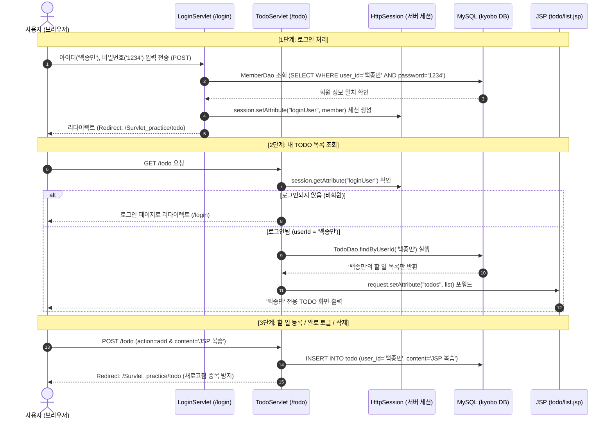

# [초보자 실습 가이드] JSP & Servlet 로그인 연동 TODO LIST 만들기 (Survlet_practice 기준)

이 가이드는 **현재 진행 중인 프로젝트(`C:\Users\user\Documents\GitHub\Survlet_practice`)를 기준**으로 작성되었습니다.  

기존에 작성했던 **단순 로그인 기능(`JSP_LOGIN_GUIDE`)**에서 한 단계 발전하여,  
`C:\Users\user\Desktop\custom_project_jdbc`의 **MySQL JDBC 연결 방식(`ConnectionProvider`)**을 접목하고,  
**로그인한 사용자를 식별하여 각자만의 TODO LIST(할 일 목록)를 관리하는 웹 애플리케이션**으로 확장하는 전체 과정을 단계별로 안내합니다.

> ⚠️ **주의**: 이 문서는 학습 안내용 가이드입니다. 기존 소스 코드를 자동으로 변경하지 않으므로, 가이드의 코드를 확인하며 본인의 프로젝트에 직접 적용해보세요!

---

## 📌 목차
1. [전체 개요 및 작업 분류표 (기존 파일 수정 vs 신규 파일 구현)](#1-전체-개요-및-작업-분류표)
2. [전체 동작 흐름 (시퀀스 다이어그램)](#2-전체-동작-흐름-시퀀스-다이어그램)
3. [프로젝트 구조 및 파일 배치도](#3-프로젝트-구조-및-파일-배치도)
4. [Step 0: Gradle 의존성 추가 (`build.gradle`)](#step-0-gradle-의존성-추가-buildgradle)
5. [Step 1: DB 스키마 및 테스트 계정 구축 (`sql/todo_schema.sql`)](#step-1-db-스키마-및-테스트-계정-구축-sqltodo_schemasql)
6. [Step 2: MySQL 연결 클래스 작성 (`ConnectionProvider.java`)](#step-2-mysql-연결-클래스-작성-connectionproviderjava)
7. [Step 3: 데이터 모델(DTO) 정비](#step-3-데이터-모델dto-정비)
   - 3.1 `Member.java` (기존 파일 수정)
   - 3.2 `TodoItem.java` (신규 파일 작성)
8. [Step 4: 데이터 접근 객체(DAO) 작성](#step-4-데이터-접근-객체dao-작성)
   - 4.1 `MemberDao.java` & `JdbcMemberDao.java`
   - 4.2 `TodoDao.java` & `JdbcTodoDao.java`
9. [Step 5: 비즈니스 로직(Service) 작성](#step-5-비즈니스-로직service-작성)
   - 5.1 `MemberService.java`
   - 5.2 `TodoService.java`
10. [Step 6: 컨트롤러(Servlet) 작성 및 수정](#step-6-컨트롤러servlet-작성-및-수정)
    - 6.1 `LoginServlet.java` (기존 파일 수정: DB 연동 & TODO 연계)
    - 6.2 `LogoutServlet.java` (기존 파일 유지 확인)
    - 6.3 `TodoServlet.java` (신규 파일 작성: 사용자 식별 & CRUD)
11. [Step 7: 화면 뷰(JSP & CSS) 작성](#step-7-화면-뷰jsp--css-작성)
    - 7.1 `assets/css/todo.css` (신규 스타일시트)
    - 7.2 `WEB-INF/views/login.jsp` (기존 폼 업데이트)
    - 7.3 `WEB-INF/views/todo/list.jsp` (신규 TODO 메인 화면)
    - 7.4 `main.jsp` (기존 메인 화면에 TODO 바로가기 링크 추가)
12. [Step 8: 실행 및 동작 테스트 시나리오](#step-8-실행-및-동작-테스트-시나리오)
13. [초보자 트러블슈팅 & 자주 묻는 질문 (FAQ)](#초보자-트러블슈팅--자주-묻는-질문-faq)

---

## 1. 전체 개요 및 작업 분류표

현재 `Survlet_practice` 프로젝트에서 **수정해야 할 기존 파일**과 **내용을 채워야 할 신규 파일**을 한눈에 정리했습니다.

| 분류 | 대상 파일 경로 | 작업 내용 |
| :--- | :--- | :--- |
| 🔄 **기존 수정** | `build.gradle` | MySQL 드라이버(`mysql-connector-j`) 및 JSTL 라이브러리 의존성 추가 |
| 🔄 **기존 수정** | `src/.../config/ConnectionProvider.java` | 빈 클래스에 MySQL 접속 로직(`localhost:3306/kyobo`, `root`/`0000`) 구현 |
| 🔄 **기존 수정** | `src/.../model/Member.java` | DB 컬럼에 맞추어 `password` 필드 및 생성자 추가 |
| 🔄 **기존 수정** | `src/.../controller/LoginServlet.java` | 하드코딩 인증을 `MemberService(DB)` 연동으로 교체하고 로그인 성공 시 `/todo`로 연결 |
| 🔄 **선택 수정** | `src/.../main.jsp` | 메인 페이지에 [내 TODO 관리 바로가기] 버튼 추가 |
| 🔄 **선택 수정** | `src/.../WEB-INF/views/login.jsp` | 신규 스타일(`todo.css`) 링크 및 힌트 텍스트 업데이트 |
| 🆕 **신규 작성** | `sql/todo_schema.sql` | `member`, `todo` 테이블 DDL 및 `백종민`/`김유진` 계정 INSERT |
| 🆕 **신규 작성** | `src/.../model/TodoItem.java` | 할 일 1건의 데이터를 표현하는 DTO |
| 🆕 **신규 작성** | `src/.../dao/MemberDao.java` & `JdbcMemberDao.java` | DB에서 회원 아이디/비밀번호를 조회하는 DAO |
| 🆕 **신규 작성** | `src/.../dao/TodoDao.java` & `JdbcTodoDao.java` | 사용자별 TODO 목록 조회, 추가, 완료 토글, 삭제 SQL 실행 |
| 🆕 **신규 작성** | `src/.../service/MemberService.java` | 로그인 비즈니스 로직 및 유효성 검사 |
| 🆕 **신규 작성** | `src/.../service/TodoService.java` | 할 일 등록/수정/삭제 비즈니스 로직 |
| 🆕 **신규 작성** | `src/.../controller/TodoServlet.java` | 세션에서 로그인 사용자 식별 후 본인 TODO만 제어하는 컨트롤러 (`/todo`) |
| 🆕 **신규 작성** | `src/.../webapp/assets/css/todo.css` | 로그인 및 TODO 전용 카드형 UI 스타일시트 |
| 🆕 **신규 작성** | `src/.../webapp/WEB-INF/views/todo/list.jsp` | 본인 할 일 목록 출력, 추가, 완료 체크(✅), 삭제 뷰 |

---

## 2. 전체 동작 흐름 (시퀀스 다이어그램)

사용자가 로그인하면 세션에 회원 객체를 보관하고, TODO 페이지에 들어올 때 세션의 아이디(`user_id`)를 기준으로 데이터베이스를 조회합니다.



---

## 3. 프로젝트 구조 및 파일 배치도

`C:\Users\user\Documents\GitHub\Survlet_practice` 기준 구조입니다.

```text
Survlet_practice/
 ├── build.gradle                               [기존 수정] MySQL, JSTL 의존성 추가
 ├── sql/
 │    ├── schema.sql
 │    └── todo_schema.sql                       [신규 작성] 테이블 생성 및 테스트 계정
 └── src/
      └── main/
           ├── java/
           │    └── com/kyobo/web/
           │         ├── config/
           │         │    └── ConnectionProvider.java   [기존 수정] MySQL JDBC 연결 코드 구현
           │         ├── controller/
           │         │    ├── HelloServlet.java         (기존 유지)
           │         │    ├── LoginServlet.java         [기존 수정] DB 연동 및 /todo 리다이렉트
           │         │    ├── LogoutServlet.java        (기존 유지)
           │         │    └── TodoServlet.java          [신규 작성] TODO 메인 컨트롤러
           │         ├── dao/
           │         │    ├── MemberDao.java            [신규 작성] 회원 DAO 인터페이스
           │         │    ├── JdbcMemberDao.java        [신규 작성] 회원 JDBC 구현체
           │         │    ├── TodoDao.java              [신규 작성] 할 일 DAO 인터페이스
           │         │    └── JdbcTodoDao.java          [신규 작성] 할 일 JDBC 구현체
           │         ├── model/
           │         │    ├── Member.java               [기존 수정] password 필드 추가
           │         │    └── TodoItem.java             [신규 작성] 할 일 DTO
           │         └── service/
           │              ├── MemberService.java        [신규 작성] 회원 인증 서비스
           │              └── TodoService.java          [신규 작성] 할 일 비즈니스 서비스
           └── webapp/
                ├── assets/
                │    └── css/
                │         ├── style.css                 (기존 유지)
                │         └── todo.css                  [신규 작성] 깔끔한 UI 스타일시트
                ├── index.html                          (기존 유지)
                ├── main.jsp                            [선택 수정] TODO 바로가기 링크 추가
                └── WEB-INF/
                     └── views/
                          ├── login.jsp                 [선택 수정] 스타일 및 테스트 계정 힌트
                          └── todo/
                               └── list.jsp             [신규 작성] 할 일 목록 뷰 화면
```

---

## Step 0: Gradle 의존성 추가 (`build.gradle`)

MySQL 데이터베이스에 접속하고, JSP에서 편리하게 반복문(`c:forEach`)과 조건문(`c:if`)을 쓰려면 **MySQL 드라이버**와 **JSTL** 라이브러리가 필요합니다.

- **파일 위치**: `build.gradle` (기존 파일 수정)

```groovy
plugins {
    id 'java'
    id 'war'
}

group = 'org.example'
version = '1.0-SNAPSHOT'

repositories {
    mavenCentral()
}

dependencies {
    compileOnly 'jakarta.servlet:jakarta.servlet-api:6.1.0'

    // 1. MySQL JDBC 드라이버 추가 (custom_project_jdbc와 동일)
    implementation 'com.mysql:mysql-connector-j:9.5.0'

    // 2. Jakarta JSTL 라이브러리 추가 (Tomcat 10+ 호환)
    implementation 'jakarta.servlet.jsp.jstl:jakarta.servlet.jsp.jstl-api:3.0.1'
    implementation 'org.glassfish.web:jakarta.servlet.jsp.jstl:3.0.1'
}
```

> **⚡ 중요**: `build.gradle` 수정 후 IntelliJ 우측 상단의 **코끼리 아이콘(Gradle 새로고침)**을 반드시 클릭하여 라이브러리를 내려받아야 빨간 줄이 뜨지 않습니다.

---

## Step 1: DB 스키마 및 테스트 계정 구축 (`sql/todo_schema.sql`)

MySQL Workbench 또는 콘솔에서 실행하여 데이터베이스와 테이블을 구성합니다.

- **파일 위치**: `sql/todo_schema.sql` (신규 파일 작성)

```sql
-- 1. kyobo 데이터베이스 사용 (없으면 생성)
CREATE DATABASE IF NOT EXISTS kyobo
  CHARACTER SET utf8mb4 COLLATE utf8mb4_0900_ai_ci;
USE kyobo;

-- 2. 회원 테이블 (member)
CREATE TABLE IF NOT EXISTS member (
    user_id VARCHAR(50) PRIMARY KEY COMMENT '사용자 아이디 (로그인 식별자)',
    password VARCHAR(100) NOT NULL COMMENT '비밀번호',
    name VARCHAR(50) NOT NULL COMMENT '사용자 이름/닉네임',
    created_at TIMESTAMP DEFAULT CURRENT_TIMESTAMP COMMENT '가입일'
);

-- 3. 할 일 테이블 (todo)
CREATE TABLE IF NOT EXISTS todo (
    id BIGINT AUTO_INCREMENT PRIMARY KEY COMMENT '할 일 고유 번호',
    user_id VARCHAR(50) NOT NULL COMMENT '작성자 회원 아이디',
    content VARCHAR(255) NOT NULL COMMENT '할 일 내용',
    is_done BOOLEAN DEFAULT FALSE COMMENT '완료 여부 (0: 미완료, 1: 완료)',
    created_at TIMESTAMP DEFAULT CURRENT_TIMESTAMP COMMENT '등록일',
    CONSTRAINT fk_todo_member FOREIGN KEY (user_id) REFERENCES member(user_id) ON DELETE CASCADE
);

-- 4. 요청하신 테스트 계정 추가 (아이디: 백종민/1234, 김유진/1234)
INSERT INTO member (user_id, password, name)
VALUES 
    ('백종민', '1234', '백종민'),
    ('김유진', '1234', '김유진')
ON DUPLICATE KEY UPDATE name = VALUES(name);

-- 5. 테스트용 초기 할 일 샘플 데이터
INSERT INTO todo (user_id, content, is_done)
VALUES 
    ('백종민', 'JSP와 서블릿 개념 복습하기', TRUE),
    ('백종민', 'ConnectionProvider로 MySQL 연결 테스트하기', FALSE),
    ('김유진', 'MySQL Workbench에서 테이블 생성 완료하기', TRUE),
    ('김유진', 'JSTL c:forEach 문법 확인하기', FALSE);
```

---

## Step 2: MySQL 연결 클래스 작성 (`ConnectionProvider.java`)

`C:\Users\user\Desktop\custom_project_jdbc`에서 사용하던 검증된 MySQL 연결 코드를 그대로 가져옵니다.

- **파일 위치**: `src/main/java/com/kyobo/web/config/ConnectionProvider.java` (기존 빈 클래스 수정)

```java
package com.kyobo.web.config;

import java.sql.Connection;
import java.sql.DriverManager;
import java.sql.SQLException;

public class ConnectionProvider {

    private static final String URL =
            "jdbc:mysql://localhost:3306/kyobo"
                    + "?serverTimezone=Asia/Seoul"
                    + "&characterEncoding=UTF-8"
                    + "&useSSL=false"
                    + "&allowPublicKeyRetrieval=true";

    private static final String USER = "root";
    private static final String PASSWORD = "0000";

    public static Connection getConnection() throws SQLException {
        try {
            Class.forName("com.mysql.cj.jdbc.Driver");
        } catch (ClassNotFoundException e) {
            throw new SQLException("MySQL JDBC 드라이버를 찾을 수 없습니다.", e);
        }

        return DriverManager.getConnection(URL, USER, PASSWORD);
    }
}
```

---

## Step 3: 데이터 모델(DTO) 정비

### 3.1 `Member.java` (기존 파일 수정)
DB의 `password` 컬럼을 검증하고 다루기 위해 `password` 필드와 생성자를 추가합니다.

- **파일 위치**: `src/main/java/com/kyobo/web/model/Member.java`

```java
package com.kyobo.web.model;

import java.io.Serializable;
import java.time.LocalDateTime;

/**
 * 세션 및 DB 연동 회원 정보 객체
 */
public class Member implements Serializable {
    private static final long serialVersionUID = 1L;

    private String userId;
    private String password;
    private String name;
    private String email;
    private LocalDateTime createdAt;

    public Member() {}

    public Member(String userId, String password, String name) {
        this.userId = userId;
        this.password = password;
        this.name = name;
    }

    public Member(String userId, String name, String email, String password) {
        this.userId = userId;
        this.name = name;
        this.email = email;
        this.password = password;
    }

    public String getUserId() {
        return userId;
    }

    public void setUserId(String userId) {
        this.userId = userId;
    }

    public String getPassword() {
        return password;
    }

    public void setPassword(String password) {
        this.password = password;
    }

    public String getName() {
        return name;
    }

    public void setName(String name) {
        this.name = name;
    }

    public String getEmail() {
        return email;
    }

    public void setEmail(String email) {
        this.email = email;
    }

    public LocalDateTime getCreatedAt() {
        return createdAt;
    }

    public void setCreatedAt(LocalDateTime createdAt) {
        this.createdAt = createdAt;
    }

    @Override
    public String toString() {
        return "Member{" +
                "userId='" + userId + '\'' +
                ", name='" + name + '\'' +
                '}';
    }
}
```

---

### 3.2 `TodoItem.java` (신규 파일 작성)
할 일 1건을 담는 객체입니다.

- **파일 위치**: `src/main/java/com/kyobo/web/model/TodoItem.java`

```java
package com.kyobo.web.model;

import java.time.LocalDateTime;

public class TodoItem {
    private Long id;
    private String userId;
    private String content;
    private boolean done;
    private LocalDateTime createdAt;

    public TodoItem() {}

    public TodoItem(String userId, String content) {
        this.userId = userId;
        this.content = content;
        this.done = false;
    }

    public Long getId() {
        return id;
    }

    public void setId(Long id) {
        this.id = id;
    }

    public String getUserId() {
        return userId;
    }

    public void setUserId(String userId) {
        this.userId = userId;
    }

    public String getContent() {
        return content;
    }

    public void setContent(String content) {
        this.content = content;
    }

    public boolean isDone() {
        return done;
    }

    public void setDone(boolean done) {
        this.done = done;
    }

    public LocalDateTime getCreatedAt() {
        return createdAt;
    }

    public void setCreatedAt(LocalDateTime createdAt) {
        this.createdAt = createdAt;
    }
}
```

---

## Step 4: 데이터 접근 객체(DAO) 작성

### 4.1 회원 DAO: `MemberDao.java` & `JdbcMemberDao.java`

- **인터페이스 위치**: `src/main/java/com/kyobo/web/dao/MemberDao.java`

```java
package com.kyobo.web.dao;

import com.kyobo.web.model.Member;
import java.sql.SQLException;
import java.util.Optional;

public interface MemberDao {
    Optional<Member> findById(String userId) throws SQLException;
    Optional<Member> findByIdAndPassword(String userId, String password) throws SQLException;
}
```

- **구현체 위치**: `src/main/java/com/kyobo/web/dao/JdbcMemberDao.java`

```java
package com.kyobo.web.dao;

import com.kyobo.web.config.ConnectionProvider;
import com.kyobo.web.model.Member;

import java.sql.*;
import java.util.Optional;

public class JdbcMemberDao implements MemberDao {

    private Member map(ResultSet rs) throws SQLException {
        Member m = new Member();
        m.setUserId(rs.getString("user_id"));
        m.setPassword(rs.getString("password"));
        m.setName(rs.getString("name"));
        Timestamp ts = rs.getTimestamp("created_at");
        if (ts != null) {
            m.setCreatedAt(ts.toLocalDateTime());
        }
        return m;
    }

    @Override
    public Optional<Member> findById(String userId) throws SQLException {
        String sql = "SELECT user_id, password, name, created_at FROM member WHERE user_id = ?";
        try (Connection conn = ConnectionProvider.getConnection();
             PreparedStatement ps = conn.prepareStatement(sql)) {
            ps.setString(1, userId);
            try (ResultSet rs = ps.executeQuery()) {
                return rs.next() ? Optional.of(map(rs)) : Optional.empty();
            }
        }
    }

    @Override
    public Optional<Member> findByIdAndPassword(String userId, String password) throws SQLException {
        String sql = "SELECT user_id, password, name, created_at FROM member WHERE user_id = ? AND password = ?";
        try (Connection conn = ConnectionProvider.getConnection();
             PreparedStatement ps = conn.prepareStatement(sql)) {
            ps.setString(1, userId);
            ps.setString(2, password);
            try (ResultSet rs = ps.executeQuery()) {
                return rs.next() ? Optional.of(map(rs)) : Optional.empty();
            }
        }
    }
}
```

---

### 4.2 할 일 DAO: `TodoDao.java` & `JdbcTodoDao.java`

- **인터페이스 위치**: `src/main/java/com/kyobo/web/dao/TodoDao.java`

```java
package com.kyobo.web.dao;

import com.kyobo.web.model.TodoItem;
import java.sql.SQLException;
import java.util.List;

public interface TodoDao {
    List<TodoItem> findByUserId(String userId) throws SQLException;
    long insert(TodoItem item) throws SQLException;
    boolean toggleDone(long id, String userId) throws SQLException;
    boolean delete(long id, String userId) throws SQLException;
}
```

- **구현체 위치**: `src/main/java/com/kyobo/web/dao/JdbcTodoDao.java`

```java
package com.kyobo.web.dao;

import com.kyobo.web.config.ConnectionProvider;
import com.kyobo.web.model.TodoItem;

import java.sql.*;
import java.util.ArrayList;
import java.util.List;

public class JdbcTodoDao implements TodoDao {

    private TodoItem map(ResultSet rs) throws SQLException {
        TodoItem item = new TodoItem();
        item.setId(rs.getLong("id"));
        item.setUserId(rs.getString("user_id"));
        item.setContent(rs.getString("content"));
        item.setDone(rs.getBoolean("is_done"));
        Timestamp ts = rs.getTimestamp("created_at");
        if (ts != null) {
            item.setCreatedAt(ts.toLocalDateTime());
        }
        return item;
    }

    @Override
    public List<TodoItem> findByUserId(String userId) throws SQLException {
        // [중요] 로그인한 사용자 본인의 아이디로만 필터링!
        String sql = "SELECT id, user_id, content, is_done, created_at FROM todo WHERE user_id = ? ORDER BY id DESC";
        List<TodoItem> list = new ArrayList<>();
        try (Connection conn = ConnectionProvider.getConnection();
             PreparedStatement ps = conn.prepareStatement(sql)) {
            ps.setString(1, userId);
            try (ResultSet rs = ps.executeQuery()) {
                while (rs.next()) {
                    list.add(map(rs));
                }
            }
        }
        return list;
    }

    @Override
    public long insert(TodoItem item) throws SQLException {
        String sql = "INSERT INTO todo (user_id, content, is_done) VALUES (?, ?, ?)";
        try (Connection conn = ConnectionProvider.getConnection();
             PreparedStatement ps = conn.prepareStatement(sql, Statement.RETURN_GENERATED_KEYS)) {
            ps.setString(1, item.getUserId());
            ps.setString(2, item.getContent());
            ps.setBoolean(3, item.isDone());
            ps.executeUpdate();

            try (ResultSet rs = ps.getGeneratedKeys()) {
                if (rs.next()) {
                    return rs.getLong(1);
                }
            }
        }
        return 0;
    }

    @Override
    public boolean toggleDone(long id, String userId) throws SQLException {
        // [보안] 다른 사람의 할 일을 수정할 수 없도록 user_id 조건을 반드시 명시합니다.
        String sql = "UPDATE todo SET is_done = NOT is_done WHERE id = ? AND user_id = ?";
        try (Connection conn = ConnectionProvider.getConnection();
             PreparedStatement ps = conn.prepareStatement(sql)) {
            ps.setLong(1, id);
            ps.setString(2, userId);
            return ps.executeUpdate() == 1;
        }
    }

    @Override
    public boolean delete(long id, String userId) throws SQLException {
        // [보안] 다른 사람의 할 일을 삭제할 수 없도록 user_id 조건을 반드시 명시합니다.
        String sql = "DELETE FROM todo WHERE id = ? AND user_id = ?";
        try (Connection conn = ConnectionProvider.getConnection();
             PreparedStatement ps = conn.prepareStatement(sql)) {
            ps.setLong(1, id);
            ps.setString(2, userId);
            return ps.executeUpdate() == 1;
        }
    }
}
```

---

## Step 5: 비즈니스 로직(Service) 작성

### 5.1 `MemberService.java` (신규 파일 작성)
- **파일 위치**: `src/main/java/com/kyobo/web/service/MemberService.java`

```java
package com.kyobo.web.service;

import com.kyobo.web.dao.MemberDao;
import com.kyobo.web.model.Member;

import java.util.Optional;

public class MemberService {
    private final MemberDao memberDao;

    public MemberService(MemberDao memberDao) {
        this.memberDao = memberDao;
    }

    public Member login(String userId, String password) throws Exception {
        if (userId == null || userId.isBlank() || password == null || password.isBlank()) {
            throw new IllegalArgumentException("아이디와 비밀번호를 모두 입력해주세요.");
        }

        Optional<Member> memberOpt = memberDao.findByIdAndPassword(userId.trim(), password.trim());
        return memberOpt.orElse(null);
    }
}
```

---

### 5.2 `TodoService.java` (신규 파일 작성)
- **파일 위치**: `src/main/java/com/kyobo/web/service/TodoService.java`

```java
package com.kyobo.web.service;

import com.kyobo.web.dao.TodoDao;
import com.kyobo.web.model.TodoItem;

import java.util.List;

public class TodoService {
    private final TodoDao todoDao;

    public TodoService(TodoDao todoDao) {
        this.todoDao = todoDao;
    }

    public List<TodoItem> getTodoList(String userId) throws Exception {
        return todoDao.findByUserId(userId);
    }

    public long addTodo(String userId, String content) throws Exception {
        if (content == null || content.isBlank()) {
            throw new IllegalArgumentException("할 일 내용을 입력해주세요.");
        }
        TodoItem item = new TodoItem(userId, content.trim());
        return todoDao.insert(item);
    }

    public void toggleStatus(long id, String userId) throws Exception {
        boolean updated = todoDao.toggleDone(id, userId);
        if (!updated) {
            throw new IllegalStateException("해당 할 일을 찾을 수 없거나 수정 권한이 없습니다.");
        }
    }

    public void removeTodo(long id, String userId) throws Exception {
        boolean deleted = todoDao.delete(id, userId);
        if (!deleted) {
            throw new IllegalStateException("해당 할 일을 찾을 수 없거나 삭제 권한이 없습니다.");
        }
    }
}
```

---

## Step 6: 컨트롤러(Servlet) 작성 및 수정

### 6.1 `LoginServlet.java` (기존 파일 수정)
기존의 하드코딩 검증 방식(`authenticate()`)을 **`MemberService`를 통한 MySQL DB 조회**로 교체하고, 로그인 성공 시 메인 화면 대신 곧바로 **`/todo` 화면으로 이동**하도록 변경합니다.

- **파일 위치**: `src/main/java/com/kyobo/web/controller/LoginServlet.java`

```java
package com.kyobo.web.controller;

import com.kyobo.web.dao.JdbcMemberDao;
import com.kyobo.web.model.Member;
import com.kyobo.web.service.MemberService;
import jakarta.servlet.ServletException;
import jakarta.servlet.annotation.WebServlet;
import jakarta.servlet.http.HttpServlet;
import jakarta.servlet.http.HttpServletRequest;
import jakarta.servlet.http.HttpServletResponse;
import jakarta.servlet.http.HttpSession;

import java.io.IOException;

@WebServlet("/login")
public class LoginServlet extends HttpServlet {
    private MemberService memberService;

    @Override
    public void init() {
        // DB와 연결된 Service 초기화
        memberService = new MemberService(new JdbcMemberDao());
    }

    @Override
    protected void doGet(HttpServletRequest request, HttpServletResponse response)
            throws ServletException, IOException {

        // 이미 로그인되어 있으면 곧바로 TODO 화면으로 이동
        HttpSession session = request.getSession(false);
        if (session != null && session.getAttribute("loginUser") != null) {
            response.sendRedirect(request.getContextPath() + "/todo");
            return;
        }

        // 로그인 폼 JSP로 이동
        request.getRequestDispatcher("/WEB-INF/views/login.jsp").forward(request, response);
    }

    @Override
    protected void doPost(HttpServletRequest request, HttpServletResponse response)
            throws ServletException, IOException {

        // 한글 인코딩 설정 필수 (백종민, 김유진 등 한글 아이디 지원)
        request.setCharacterEncoding("UTF-8");

        String userId = request.getParameter("userId");
        String password = request.getParameter("password");

        try {
            // MySQL DB에서 사용자 인증
            Member authMember = memberService.login(userId, password);

            if (authMember != null) {
                // [인증 성공]
                HttpSession session = request.getSession(true);
                session.setAttribute("loginUser", authMember);
                session.setMaxInactiveInterval(1800); // 30분 유지

                // TODO 페이지로 리다이렉트
                response.sendRedirect(request.getContextPath() + "/todo");
            } else {
                // [인증 실패]
                request.setAttribute("errorMessage", "아이디 또는 비밀번호가 올바르지 않습니다.");
                request.getRequestDispatcher("/WEB-INF/views/login.jsp").forward(request, response);
            }
        } catch (IllegalArgumentException e) {
            request.setAttribute("errorMessage", e.getMessage());
            request.getRequestDispatcher("/WEB-INF/views/login.jsp").forward(request, response);
        } catch (Exception e) {
            throw new ServletException("로그인 처리 중 데이터베이스 오류가 발생했습니다.", e);
        }
    }
}
```

---

### 6.2 `LogoutServlet.java` (기존 유지 확인)
기존에 작성되어 있던 로그아웃 서블릿은 그대로 유지하면 됩니다. 세션을 파기하고 로그인 페이지로 보냅니다.

- **파일 위치**: `src/main/java/com/kyobo/web/controller/LogoutServlet.java`

---

### 6.3 `TodoServlet.java` (신규 파일 작성)
로그인 세션을 검사하여 **본인의 아이디(`loginUser.getUserId()`)**로만 조회/추가/토글/삭제를 수행합니다.

- **파일 위치**: `src/main/java/com/kyobo/web/controller/TodoServlet.java`

```java
package com.kyobo.web.controller;

import com.kyobo.web.dao.JdbcTodoDao;
import com.kyobo.web.model.Member;
import com.kyobo.web.service.TodoService;
import jakarta.servlet.ServletException;
import jakarta.servlet.annotation.WebServlet;
import jakarta.servlet.http.HttpServlet;
import jakarta.servlet.http.HttpServletRequest;
import jakarta.servlet.http.HttpServletResponse;
import jakarta.servlet.http.HttpSession;

import java.io.IOException;

@WebServlet("/todo")
public class TodoServlet extends HttpServlet {
    private TodoService todoService;

    @Override
    public void init() {
        todoService = new TodoService(new JdbcTodoDao());
    }

    /**
     * GET 요청: 로그인 사용자의 TODO 목록 조회
     */
    @Override
    protected void doGet(HttpServletRequest req, HttpServletResponse res) throws ServletException, IOException {
        Member loginUser = getLoginUser(req);
        if (loginUser == null) {
            // 미로그인 시 로그인 페이지로 강제 리다이렉트
            res.sendRedirect(req.getContextPath() + "/login");
            return;
        }

        try {
            // 본인 아이디의 할 일 목록만 조회
            req.setAttribute("todos", todoService.getTodoList(loginUser.getUserId()));
            req.getRequestDispatcher("/WEB-INF/views/todo/list.jsp").forward(req, res);
        } catch (Exception e) {
            throw new ServletException(e);
        }
    }

    /**
     * POST 요청: 할 일 추가(add), 완료 토글(toggle), 삭제(delete)
     */
    @Override
    protected void doPost(HttpServletRequest req, HttpServletResponse res) throws ServletException, IOException {
        req.setCharacterEncoding("UTF-8");

        Member loginUser = getLoginUser(req);
        if (loginUser == null) {
            res.sendRedirect(req.getContextPath() + "/login");
            return;
        }

        String action = req.getParameter("action");
        String currentUserId = loginUser.getUserId();

        try {
            if ("add".equals(action)) {
                String content = req.getParameter("content");
                todoService.addTodo(currentUserId, content);
            } else if ("toggle".equals(action)) {
                long id = Long.parseLong(req.getParameter("id"));
                todoService.toggleStatus(id, currentUserId);
            } else if ("delete".equals(action)) {
                long id = Long.parseLong(req.getParameter("id"));
                todoService.removeTodo(id, currentUserId);
            }

            // 요청 완료 후 리다이렉트 (PRG 패턴: 브라우저 새로고침 시 폼 재전송 방지)
            res.sendRedirect(req.getContextPath() + "/todo");
        } catch (IllegalArgumentException e) {
            req.getSession().setAttribute("flashError", e.getMessage());
            res.sendRedirect(req.getContextPath() + "/todo");
        } catch (Exception e) {
            throw new ServletException(e);
        }
    }

    private Member getLoginUser(HttpServletRequest req) {
        HttpSession session = req.getSession(false);
        if (session != null) {
            return (Member) session.getAttribute("loginUser");
        }
        return null;
    }
}
```

---

## Step 7: 화면 뷰(JSP & CSS) 작성

기존 로그인 디자인과 일관되면서도, 깔끔한 카드 스타일과 완료 체크 표시를 제공합니다.

### 7.1 `assets/css/todo.css` (신규 스타일시트)
- **파일 위치**: `src/main/webapp/assets/css/todo.css`

```css
* {
    box-sizing: border-box;
    margin: 0;
    padding: 0;
}

body {
    font-family: -apple-system, BlinkMacSystemFont, "Segoe UI", Roboto, "Noto Sans KR", sans-serif;
    background-color: #f0f2f5;
    color: #2c3e50;
    min-height: 100vh;
    display: flex;
    justify-content: center;
    align-items: center;
    padding: 24px 16px;
}

.app-card {
    background: #ffffff;
    width: 100%;
    max-width: 480px;
    border-radius: 12px;
    box-shadow: 0 10px 25px rgba(0, 0, 0, 0.08);
    padding: 32px 28px;
}

.app-header {
    text-align: center;
    margin-bottom: 24px;
}

.app-title {
    font-size: 24px;
    font-weight: 700;
    color: #1a202c;
    margin-bottom: 6px;
}

.app-subtitle {
    font-size: 13px;
    color: #718096;
}

.user-bar {
    display: flex;
    justify-content: space-between;
    align-items: center;
    background: #ebf8ff;
    border: 1px solid #bee3f8;
    padding: 10px 16px;
    border-radius: 8px;
    margin-bottom: 20px;
}

.user-badge {
    font-size: 14px;
    font-weight: 600;
    color: #2b6cb0;
}

.btn-logout {
    font-size: 12px;
    color: #e53e3e;
    text-decoration: none;
    font-weight: 600;
    border: 1px solid #feb2b2;
    padding: 4px 10px;
    border-radius: 4px;
    background: #fff;
    transition: all 0.2s;
}

.btn-logout:hover {
    background: #e53e3e;
    color: #fff;
}

.form-group {
    margin-bottom: 16px;
}

.form-label {
    display: block;
    font-size: 13px;
    font-weight: 600;
    margin-bottom: 6px;
    color: #4a5568;
}

.form-input {
    width: 100%;
    padding: 10px 14px;
    border: 1px solid #cbd5e0;
    border-radius: 6px;
    font-size: 14px;
    outline: none;
    transition: border-color 0.2s;
}

.form-input:focus {
    border-color: #3182ce;
    box-shadow: 0 0 0 3px rgba(49, 130, 206, 0.15);
}

.btn-primary {
    width: 100%;
    padding: 12px;
    background-color: #3182ce;
    color: #ffffff;
    border: none;
    border-radius: 6px;
    font-size: 15px;
    font-weight: 600;
    cursor: pointer;
    transition: background-color 0.2s;
}

.btn-primary:hover {
    background-color: #2b6cb0;
}

.todo-input-form {
    display: flex;
    gap: 8px;
    margin-bottom: 20px;
}

.todo-input-form input {
    flex: 1;
}

.btn-add {
    padding: 0 18px;
    background-color: #3182ce;
    color: white;
    border: none;
    border-radius: 6px;
    font-weight: 600;
    cursor: pointer;
}

.btn-add:hover {
    background-color: #2b6cb0;
}

.todo-list {
    list-style: none;
}

.todo-item {
    display: flex;
    align-items: center;
    justify-content: space-between;
    padding: 12px;
    background: #f7fafc;
    border: 1px solid #edf2f7;
    border-radius: 8px;
    margin-bottom: 10px;
}

.todo-content-box {
    display: flex;
    align-items: center;
    gap: 12px;
    flex: 1;
}

.todo-checkbox-btn {
    background: none;
    border: none;
    cursor: pointer;
    font-size: 18px;
    line-height: 1;
}

.todo-text {
    font-size: 14px;
    color: #2d3748;
    word-break: break-all;
}

.todo-item.done .todo-text {
    text-decoration: line-through;
    color: #a0aec0;
}

.btn-delete {
    background: none;
    border: none;
    color: #a0aec0;
    cursor: pointer;
    font-size: 16px;
    padding: 4px;
    transition: color 0.2s;
}

.btn-delete:hover {
    color: #e53e3e;
}

.empty-state {
    text-align: center;
    padding: 30px 10px;
    color: #a0aec0;
    font-size: 14px;
}

.error-box {
    background-color: #fff5f5;
    color: #c53030;
    padding: 10px;
    border-radius: 6px;
    font-size: 13px;
    margin-bottom: 16px;
    text-align: center;
    border: 1px solid #fed7d7;
}

.hint-box {
    margin-top: 20px;
    background-color: #f7fafc;
    padding: 12px;
    border-radius: 6px;
    font-size: 12px;
    color: #718096;
    line-height: 1.6;
}
```

---

### 7.2 `WEB-INF/views/login.jsp` (기존 폼 업데이트)
- **파일 위치**: `src/main/webapp/WEB-INF/views/login.jsp`

```jsp
<%@ page contentType="text/html; charset=UTF-8" pageEncoding="UTF-8" %>
<%@ taglib prefix="c" uri="jakarta.tags.core" %>

<!DOCTYPE html>
<html lang="ko">
<head>
    <meta charset="UTF-8">
    <title>로그인 - TODO 서비스</title>
    <link rel="stylesheet" href="${pageContext.request.contextPath}/assets/css/todo.css">
</head>
<body>

<div class="app-card">
    <div class="app-header">
        <h1 class="app-title">로그인</h1>
        <p class="app-subtitle">내 TODO LIST 서비스를 이용하려면 로그인하세요</p>
    </div>

    <!-- 에러 메시지 표시 -->
    <c:if test="${not empty errorMessage}">
        <div class="error-box">
            ${errorMessage}
        </div>
    </c:if>

    <form action="${pageContext.request.contextPath}/login" method="post">
        <div class="form-group">
            <label class="form-label" for="userId">아이디</label>
            <input class="form-input" type="text" id="userId" name="userId" required placeholder="아이디 입력">
        </div>

        <div class="form-group">
            <label class="form-label" for="password">비밀번호</label>
            <input class="form-input" type="password" id="password" name="password" required placeholder="비밀번호 입력">
        </div>

        <button type="submit" class="btn-primary">로그인</button>
    </form>

    <div class="hint-box">
        <strong>💡 등록된 테스트 계정:</strong><br>
        - 아이디: <code>백종민</code> / 비밀번호: <code>1234</code><br>
        - 아이디: <code>김유진</code> / 비밀번호: <code>1234</code>
    </div>
</div>

</body>
</html>
```

---

### 7.3 `WEB-INF/views/todo/list.jsp` (신규 TODO 메인 화면)
- **파일 위치**: `src/main/webapp/WEB-INF/views/todo/list.jsp`

```jsp
<%@ page contentType="text/html; charset=UTF-8" pageEncoding="UTF-8" %>
<%@ taglib prefix="c" uri="jakarta.tags.core" %>

<!DOCTYPE html>
<html lang="ko">
<head>
    <meta charset="UTF-8">
    <title>내 할 일 목록 - TODO LIST</title>
    <link rel="stylesheet" href="${pageContext.request.contextPath}/assets/css/todo.css">
</head>
<body>

<div class="app-card">
    <!-- 로그인 사용자 헤더 바 -->
    <div class="user-bar">
        <div class="user-badge">
            👤 <span>${sessionScope.loginUser.name}</span>님의 할 일
        </div>
        <a href="${pageContext.request.contextPath}/logout" class="btn-logout">로그아웃</a>
    </div>

    <!-- 플래시 에러 메시지 -->
    <c:if test="${not empty sessionScope.flashError}">
        <div class="error-box">
            ${sessionScope.flashError}
        </div>
        <c:remove var="flashError" scope="session"/>
    </c:if>

    <!-- 할 일 등록 입력창 -->
    <form class="todo-input-form" action="${pageContext.request.contextPath}/todo" method="post">
        <input type="hidden" name="action" value="add">
        <input class="form-input" type="text" name="content" placeholder="오늘 해야 할 일을 입력하세요..." required autofocus>
        <button type="submit" class="btn-add">추가</button>
    </form>

    <!-- 할 일 목록 리스트 -->
    <ul class="todo-list">
        <c:forEach var="todo" items="${todos}">
            <li class="todo-item ${todo.done ? 'done' : ''}">
                <div class="todo-content-box">
                    <!-- 상태 변경 토글 버튼 (클릭 시 POST) -->
                    <form action="${pageContext.request.contextPath}/todo" method="post" style="display:inline;">
                        <input type="hidden" name="action" value="toggle">
                        <input type="hidden" name="id" value="${todo.id}">
                        <button type="submit" class="todo-checkbox-btn" title="완료 상태 변경">
                            ${todo.done ? '✅' : '⬜'}
                        </button>
                    </form>

                    <!-- 할 일 내용 (완료 시 취소선) -->
                    <span class="todo-text">${todo.content}</span>
                </div>

                <!-- 삭제 버튼 -->
                <form action="${pageContext.request.contextPath}/todo" method="post" style="display:inline;" onsubmit="return confirm('정말 삭제하시겠습니까?');">
                    <input type="hidden" name="action" value="delete">
                    <input type="hidden" name="id" value="${todo.id}">
                    <button type="submit" class="btn-delete" title="삭제">🗑️</button>
                </form>
            </li>
        </c:forEach>
    </ul>

    <!-- 할 일이 비어있을 때 안내 문구 -->
    <c:if test="${empty todos}">
        <div class="empty-state">
            등록된 할 일이 없습니다.<br>새로운 할 일을 추가해보세요!
        </div>
    </c:if>
</div>

</body>
</html>
```

---

### 7.4 `main.jsp` (선택 수정: 메인 화면에 TODO 링크 추가)
기존 `main.jsp`에 로그인 상태일 때 [내 TODO 관리] 버튼을 추가해주면 더욱 편리하게 이동할 수 있습니다.

- **파일 위치**: `src/main/webapp/main.jsp`

```jsp
<%@ page contentType="text/html; charset=UTF-8" pageEncoding="UTF-8" %>
<%@ page import="com.kyobo.web.model.Member" %>
<!DOCTYPE html>
<html lang="ko">
<head>
    <meta charset="UTF-8">
    <title>메인 화면</title>
    <style>
        body { font-family: sans-serif; padding: 40px; background-color: #fafafa; }
        .card { background: white; padding: 30px; border-radius: 8px; max-width: 600px; margin: 0 auto; box-shadow: 0 2px 5px rgba(0,0,0,0.1); }
        .btn { display: inline-block; padding: 8px 16px; text-decoration: none; border-radius: 4px; margin-top: 10px; margin-right: 6px; }
        .btn-primary { background: #007bff; color: white; }
        .btn-success { background: #28a745; color: white; }
        .btn-danger { background: #dc3545; color: white; }
        .user-info { background: #f0f8ff; padding: 15px; border-radius: 6px; margin: 15px 0; }
    </style>
</head>
<body>

<div class="card">
    <h1>교보 실습 웹 애플리케이션</h1>
    <hr>

    <%
        Member loginUser = (Member) session.getAttribute("loginUser");
    %>

    <% if (loginUser != null) { %>
        <div class="user-info">
            <h3>환영합니다, <%= loginUser.getName() %>님!</h3>
            <p><strong>아이디:</strong> <%= loginUser.getUserId() %></p>
        </div>
        <p>현재 정상적으로 로그인된 상태입니다.</p>
        <!-- TODO 리스트 바로가기 버튼 추가 -->
        <a href="<%= request.getContextPath() %>/todo" class="btn btn-success">내 TODO 리스트 가기</a>
        <a href="<%= request.getContextPath() %>/logout" class="btn btn-danger">로그아웃</a>
    <% } else { %>
        <p>현재 로그인되어 있지 않습니다. 서비스를 이용하려면 로그인해주세요.</p>
        <a href="<%= request.getContextPath() %>/login" class="btn btn-primary">로그인하러 가기</a>
    <% } %>
</div>

</body>
</html>
```

---

## Step 8: 실행 및 동작 테스트 시나리오

`Survlet_practice` 환경에서의 테스트 절차입니다. (URL Context Path는 `/Survlet_practice` 기준입니다)

### 1. MySQL 스크립트 실행
- MySQL Workbench 등에서 `sql/todo_schema.sql`을 실행하여 `member`와 `todo` 테이블을 생성합니다.

### 2. Gradle 동기화 및 톰캣 실행
- `build.gradle`의 종속성이 내려받아졌는지 확인한 후, IntelliJ의 Tomcat 서버를 실행합니다.

### 3. 단계별 검증 시나리오

```text
[검증 1: 비로그인 접근 차단 확인]
- 브라우저 주소창에 입력: http://localhost:8080/Survlet_practice/todo
- 결과: 로그인되지 않았으므로 자동으로 http://localhost:8080/Survlet_practice/login 으로 리다이렉트됨

[검증 2: '백종민' 계정 로그인 & TODO 관리]
- 아이디: 백종민 / 비밀번호: 1234 입력 후 [로그인]
- 결과: 상단에 "👤 백종민님의 할 일" 표시
- 목록에 '백종민'의 할 일 2건만 조회되는지 확인
- 입력창에 "Gradle 빌드 검증" 입력 후 [추가] -> 상단에 즉시 추가됨
- 네모 박스(⬜) 클릭 -> 체크 표시(✅)로 바뀌고 취소선 표시 확인
- [우측 상단 로그아웃] 클릭 -> 로그인 화면으로 이동

[검증 3: '김유진' 계정 로그인 & 사용자별 데이터 격리 확인]
- 아이디: 김유진 / 비밀번호: 1234 입력 후 [로그인]
- 결과: 상단에 "👤 김유진님의 할 일" 표시
- 방금 '백종민' 계정에서 추가한 "Gradle 빌드 검증"은 보이지 않고, 오직 '김유진'의 할 일만 노출되는지 확인
- 정상적으로 격리되어 있다면 구현 완료!
```

---

## 초보자 트러블슈팅 & 자주 묻는 질문 (FAQ)

### Q1. Gradle에 라이브러리를 추가했는데 코드에 빨간 줄이 떠요.
- `build.gradle`에 코드를 붙여넣기만 하면 자동으로 다운로드되지 않습니다.  
  IntelliJ 오른쪽 패널의 **Gradle 탭 > 새로고침(파란색 회전 화살표)** 버튼을 누르거나, 에디터 우측 상단에 뜨는 **코끼리 새로고침 아이콘**을 반드시 클릭해주세요.

### Q2. 한글 아이디(`백종민`, `김유진`) 입력 시 로그인이 안 돼요.
- 서블릿의 `doPost()` 첫 줄에 반드시 `request.setCharacterEncoding("UTF-8");`이 선언되어 있어야 파라미터가 깨지지 않습니다.
- 또한 `ConnectionProvider`의 접속 URL 파라미터에 `&characterEncoding=UTF-8`이 포함되어 있는지 확인하세요.

### Q3. `Communications link failure` 또는 `Access denied` DB 에러가 발생해요.
- `ConnectionProvider.java`에서 설정한 MySQL 포트(`3306`), 데이터베이스 이름(`kyobo`), 계정(`root`), 비밀번호(`0000`)가 본인의 로컬 MySQL 설치 환경과 일치하는지 확인하세요.

### Q4. 왜 URL 주소에 `/Survlet_practice`가 붙나요?
- 서블릿 컨테이너(Tomcat)에서 프로젝트의 **Context Path**를 `/Survlet_practice`로 지정했기 때문입니다.  
  코드 작성 시 `<%= request.getContextPath() %>` 또는 JSTL `${pageContext.request.contextPath}`를 사용하면 Context Path가 바뀌어도 유연하게 동작합니다.
