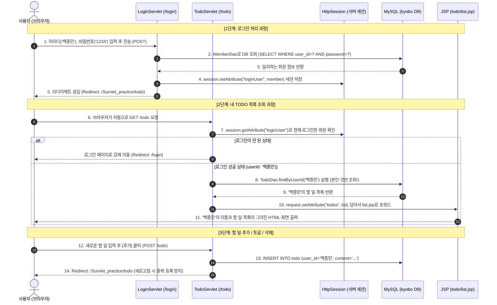

# [초보자 실습 & 학습 가이드] JSP & Servlet 로그인 연동 TODO LIST 만들기

이 가이드는 **`C:\Users\user\Documents\GitHub\Survlet_practice` 프로젝트 기준**으로 작성되었습니다.  
웹 개발을 처음 접하는 초보자분들이 **"각 파일이 어떤 역할을 담당하는지"**, **"각 줄의 코드가 왜 필요한지"**를 확실히 이해하며 공부할 수 있도록 **모든 코드에 친절한 주석과 파일별 상세 해설**을 추가했습니다.

> 💡 **학습 팁**: 코드를 단순히 복사하기보다는 주석을 천천히 읽어보며 Controller(서블릿) -> Service -> DAO -> DB로 이어지는 데이터의 흐름을 머릿속으로 그려보세요!

---

## 📌 목차
1. [각 파일의 역할과 웹 아키텍처(MVC) 이해하기](#1-각-파일의-역할과-웹-아키텍처mvc-이해하기)
2. [전체 동작 흐름 (시퀀스 다이어그램)](#2-전체-동작-흐름-시퀀스-다이어그램)
3. [Step 0: Gradle 빌드 설정 (`build.gradle`)](#step-0-gradle-빌드-설정-buildgradle)
4. [Step 1: DB 스키마 및 테스트 계정 (`sql/todo_schema.sql`)](#step-1-db-스키마-및-테스트-계정-sqltodo_schemasql)
5. [Step 2: MySQL 연결 관리 (`ConnectionProvider.java`)](#step-2-mysql-연결-관리-connectionproviderjava)
6. [Step 3: 데이터 모델 DTO (`Member.java`, `TodoItem.java`)](#step-3-데이터-모델-dto-memberjava-todoitemjava)
7. [Step 4: 데이터 접근 DAO (`MemberDao`, `TodoDao`)](#step-4-데이터-접근-dao-memberdao-tododao)
8. [Step 5: 비즈니스 로직 Service (`MemberService`, `TodoService`)](#step-5-비즈니스-로직-service-memberservice-todoservice)
9. [Step 6: 요청 처리 Controller (`LoginServlet`, `LogoutServlet`, `TodoServlet`)](#step-6-요청-처리-controller-loginservlet-logoutservlet-todoservlet)
10. [Step 7: 화면 UI 뷰 (`todo.css`, `login.jsp`, `todo/list.jsp`, `main.jsp`)](#step-7-화면-ui-뷰-todocss-loginjsp-todolistjsp-mainjsp)
11. [Step 8: 실행 및 동작 테스트 시나리오](#step-8-실행-및-동작-테스트-시나리오)
12. [핵심 개념 정리 & 자주 묻는 질문 (FAQ)](#핵심-개념-정리--자주-묻는-질문-faq)

---

## 1. 각 파일의 역할과 웹 아키텍처(MVC) 이해하기

우리가 만드는 프로그램은 실무에서 가장 널리 쓰이는 **MVC (Model - View - Controller)** 패턴 기반의 3계층 아키텍처 구조를 가집니다.

```text
[ 브라우저 (사용자) ]
       │  ▲
       │  │ (요청 및 응답)
       ▼  │
1. Controller (Servlet)   : 사용자의 요청(GET/POST)을 최초로 접수하고 화면을 어디로 보낼지 결정
       │  ▲
       ▼  │ (비즈니스 처리 요청)
2. Service                : 데이터 유효성 검증(빈칸 체크 등) 및 핵심 비즈니스 규칙 수행
       │  ▲
       ▼  │ (DB 쿼리 실행 요청)
3. DAO (Data Access Object): 실제 SQL 문장을 데이터베이스로 전송하여 데이터 CRUD 실행
       │  ▲
       ▼  │ (JDBC 통신)
[ MySQL Database ]
```

### 📂 파일별 세부 역할 안내표

| 계층 | 파일명 | 역할 및 목적 |
| :--- | :--- | :--- |
| **설정 (Config)** | `build.gradle` | 프로젝트에 필요한 외부 라이브러리(MySQL 드라이버, JSTL 등)를 선언하고 자동 다운로드합니다. |
| **설정 (Config)** | `ConnectionProvider.java` | MySQL DB와 통신할 수 있는 `Connection` 연결 객체를 한 곳에서 생성하여 DAO들에게 제공합니다. |
| **데이터베이스** | `sql/todo_schema.sql` | 회원 정보(`member`)와 할 일(`todo`)을 저장할 테이블을 정의하고 테스트 계정을 추가합니다. |
| **모델 (Model / DTO)** | `Member.java` | 회원 1명의 정보(아이디, 이름 등)를 묶어서 계층 간에 전달하고, 세션(`HttpSession`)에 보관하는 상자 역할을 합니다. |
| **모델 (Model / DTO)** | `TodoItem.java` | 할 일 1건의 정보(번호, 작성자, 내용, 완료 여부, 등록일)를 묶어주는 상자 역할을 합니다. |
| **영속 계층 (DAO)** | `MemberDao.java`<br>`JdbcMemberDao.java` | 회원 테이블을 대상으로 SQL(`SELECT`)을 실행하여 아이디/비밀번호가 맞는지 조회합니다. (인터페이스와 구현체 분리) |
| **영속 계층 (DAO)** | `TodoDao.java`<br>`JdbcTodoDao.java` | 할 일 테이블을 대상으로 `SELECT`, `INSERT`, `UPDATE`, `DELETE` SQL을 직접 실행합니다. |
| **서비스 계층 (Service)**| `MemberService.java` | 로그인을 시도할 때 아이디가 빈칸은 아닌지 검증하고 DAO를 호출하여 인증 결과를 반환합니다. |
| **서비스 계층 (Service)**| `TodoService.java` | 할 일을 추가할 때 글자 유효성을 확인하고, 완료 토글 및 삭제 권한을 검증합니다. |
| **컨트롤러 (Controller)**| `LoginServlet.java` | `/login` URL로 들어오는 요청을 받아 로그인 화면을 띄우거나(GET), 로그인 인증 후 세션을 발급(POST)합니다. |
| **컨트롤러 (Controller)**| `LogoutServlet.java` | `/logout` URL로 요청이 오면 세션을 완전히 삭제(`invalidate()`)하여 로그아웃시킵니다. |
| **컨트롤러 (Controller)**| `TodoServlet.java` | `/todo` URL로 요청이 오면 **세션에서 현재 로그인된 사용자를 확인**한 뒤, 그 사람만의 할 일 목록을 가져와 JSP로 전달합니다. |
| **뷰 (View / UI)** | `todo.css` | 로그인 및 TODO 화면의 레이아웃(카드형), 완료 취소선, 버튼 색상 등을 꾸며주는 스타일시트입니다. |
| **뷰 (View / UI)** | `login.jsp` | 사용자가 아이디와 비밀번호를 입력할 수 있는 웹 폼 화면입니다. |
| **뷰 (View / UI)** | `todo/list.jsp` | 로그인한 사용자 이름을 표시하고, 할 일 목록 출력, 추가 인풋창, 완료 체크박스(✅), 삭제 버튼을 제공합니다. |
| **뷰 (View / UI)** | `main.jsp` | 로그인 후 접속할 수 있는 기본 메인 화면으로, TODO 리스트로 이동할 수 있는 링크를 제공합니다. |

---

## 2. 전체 동작 흐름 (시퀀스 다이어그램)



---

## Step 0: Gradle 빌드 설정 (`build.gradle`)

### 📌 파일 역할
Java는 기본적으로 MySQL 데이터베이스와 대화하는 방법(드라이버)을 내장하고 있지 않습니다.  
따라서 **MySQL JDBC 드라이버**와 JSP 화면에서 편하게 반복문/조건문을 쓰게 해주는 **JSTL 라이브러리**를 Gradle을 통해 프로젝트에 추가합니다.

- **파일 위치**: `build.gradle` (기존 파일 수정)

```groovy
plugins {
    id 'java' // 자바 애플리케이션 빌드 플러그인
    id 'war'  // 톰캣(Tomcat)에 배포할 수 있는 웹 아카이브(WAR) 플러그인
}

group = 'org.example'
version = '1.0-SNAPSHOT'

repositories {
    mavenCentral() // 오픈소스 라이브러리를 중앙 저장소(Maven Central)에서 다운로드
}

dependencies {
    // 톰캣 10+ 환경에서 서블릿 코드를 컴파일할 때 필요한 Jakarta Servlet API (버전 6.1.0)
    compileOnly 'jakarta.servlet:jakarta.servlet-api:6.1.0'

    // [1] MySQL 데이터베이스 연결을 위한 공식 JDBC 드라이버 라이브러리
    // custom_project_jdbc에서 검증된 9.5.0 버전을 사용합니다.
    implementation 'com.mysql:mysql-connector-j:9.5.0'

    // [2] JSP 화면에서 <c:forEach>, <c:if> 등을 사용할 수 있게 해주는 Jakarta JSTL 라이브러리
    implementation 'jakarta.servlet.jsp.jstl:jakarta.servlet.jsp.jstl-api:3.0.1'
    implementation 'org.glassfish.web:jakarta.servlet.jsp.jstl:3.0.1'
}
```

> 💡 **적용 후 필수 작업**: 코드를 수정한 뒤 IntelliJ 우측 상단의 **코끼리 새로고침 아이콘** (또는 Gradle 탭의 새로고침 버튼)을 꼭 눌러야 라이브러리가 실제로 다운로드됩니다.

---

## Step 1: DB 스키마 및 테스트 계정 (`sql/todo_schema.sql`)

### 📌 파일 역할
회원 계정 정보를 저장할 `member` 테이블과 할 일 항목들을 저장할 `todo` 테이블을 생성합니다.  
외래키(`FOREIGN KEY`)를 설정하여 어떤 회원이 어떤 할 일을 등록했는지 안전하게 연결합니다.

- **파일 위치**: `sql/todo_schema.sql` (신규 파일 작성)

```sql
-- [1] 데이터베이스 생성 및 선택
-- kyobo라는 이름의 데이터베이스가 없으면 생성하고, 다국어(이모지 포함)를 위해 utf8mb4를 설정합니다.
CREATE DATABASE IF NOT EXISTS kyobo
  CHARACTER SET utf8mb4 COLLATE utf8mb4_0900_ai_ci;

-- 이후 실행되는 모든 테이블 생성 작업은 kyobo 데이터베이스 안에 생성됩니다.
USE kyobo;

-- [2] 회원 테이블 (member)
-- 로그인할 아이디(user_id)를 기본키(PK)로 지정하여 중복을 방지합니다.
CREATE TABLE IF NOT EXISTS member (
    user_id VARCHAR(50) PRIMARY KEY COMMENT '사용자 아이디 (로그인 식별자, 기본키)',
    password VARCHAR(100) NOT NULL COMMENT '비밀번호',
    name VARCHAR(50) NOT NULL COMMENT '사용자 이름/닉네임',
    created_at TIMESTAMP DEFAULT CURRENT_TIMESTAMP COMMENT '계정 생성 일시'
);

-- [3] 할 일 목록 테이블 (todo)
-- 각 할 일마다 번호(id)가 자동으로 1씩 증가(AUTO_INCREMENT)하며,
-- 작성자(user_id)를 member 테이블의 user_id와 연결(외래키)합니다.
CREATE TABLE IF NOT EXISTS todo (
    id BIGINT AUTO_INCREMENT PRIMARY KEY COMMENT '할 일 고유 번호 (자동 증가 PK)',
    user_id VARCHAR(50) NOT NULL COMMENT '작성자 회원 아이디 (외래키)',
    content VARCHAR(255) NOT NULL COMMENT '할 일 내용',
    is_done BOOLEAN DEFAULT FALSE COMMENT '완료 여부 (FALSE=0:미완료, TRUE=1:완료)',
    created_at TIMESTAMP DEFAULT CURRENT_TIMESTAMP COMMENT '할 일 등록 일시',
    -- 외래키 설정: 회원이 탈퇴(DELETE)되면 그 사람의 TODO도 함께 삭제(CASCADE)
    CONSTRAINT fk_todo_member FOREIGN KEY (user_id) REFERENCES member(user_id) ON DELETE CASCADE
);

-- [4] 요청하신 테스트 계정 2건 추가
-- 아이디: 백종민 / 비밀번호: 1234
-- 아이디: 김유진 / 비밀번호: 1234
INSERT INTO member (user_id, password, name)
VALUES 
    ('백종민', '1234', '백종민'),
    ('김유진', '1234', '김유진')
ON DUPLICATE KEY UPDATE name = VALUES(name); -- 이미 아이디가 존재할 경우 에러 대신 이름만 갱신

-- [5] 화면 테스트를 위한 초기 샘플 할 일 데이터 삽입
INSERT INTO todo (user_id, content, is_done)
VALUES 
    ('백종민', '서블릿과 JSP 기초 개념 정리하기', TRUE),
    ('백종민', 'ConnectionProvider로 JDBC 연결 확인하기', FALSE),
    ('김유진', 'MySQL Workbench에서 테이블 생성하기', TRUE),
    ('김유진', 'JSTL c:forEach 문법 복습하기', FALSE);
```

> 💡 **DBeaver 실행 팁**:  
> DBeaver에서 실행할 때는 `Ctrl + Enter`(한 문장만 실행) 대신, **전체 선택(`Ctrl + A`) 후 `Alt + X` (스크립트 일괄 실행)**를 누르거나, 상단 드롭다운에서 `kyobo` 데이터베이스를 선택한 뒤 실행하세요.

---

## Step 2: MySQL 연결 관리 (`ConnectionProvider.java`)

### 📌 파일 역할
데이터베이스와 Java 프로그램이 통신할 수 있는 통로인 `Connection` 객체를 생성하는 **유틸리티 클래스**입니다.  
여러 DAO들이 DB 연결이 필요할 때마다 이 클래스의 `getConnection()` 메서드를 호출합니다.

- **파일 위치**: `src/main/java/com/kyobo/web/config/ConnectionProvider.java` (기존 빈 클래스 수정)

```java
package com.kyobo.web.config;

import java.sql.Connection;
import java.sql.DriverManager;
import java.sql.SQLException;

public class ConnectionProvider {

    // [1] MySQL 연결 주소 (JDBC URL)
    // - localhost:3306 : 내 컴퓨터에서 동작 중인 MySQL 기본 포트
    // - /kyobo : 연결할 데이터베이스 이름
    // - serverTimezone=Asia/Seoul : 시간대 설정 (한국 시간)
    // - characterEncoding=UTF-8 : 한글 깨짐 방지
    private static final String URL =
            "jdbc:mysql://localhost:3306/kyobo"
                    + "?serverTimezone=Asia/Seoul"
                    + "&characterEncoding=UTF-8"
                    + "&useSSL=false"
                    + "&allowPublicKeyRetrieval=true";

    // [2] MySQL 접속 계정 정보 (로컬 기본 설정)
    private static final String USER = "root";
    private static final String PASSWORD = "0000";

    /**
     * 데이터베이스 연결(Connection) 객체를 생성하여 반환합니다.
     * DAO 클래스들에서 Connection conn = ConnectionProvider.getConnection(); 형태로 사용합니다.
     */
    public static Connection getConnection() throws SQLException {
        try {
            // MySQL JDBC 드라이버 클래스를 JVM 메모리에 로딩합니다.
            Class.forName("com.mysql.cj.jdbc.Driver");
        } catch (ClassNotFoundException e) {
            // build.gradle에 mysql-connector-j가 누락되었을 때 발생합니다.
            throw new SQLException("MySQL JDBC 드라이버를 찾을 수 없습니다. build.gradle 의존성을 확인하세요.", e);
        }

        // 설정된 URL, 계정, 비밀번호로 MySQL 서버에 연결하여 통로(Connection)를 반환합니다.
        return DriverManager.getConnection(URL, USER, PASSWORD);
    }
}
```

---

## Step 3: 데이터 모델 DTO (`Member.java`, `TodoItem.java`)

### 📌 파일 역할 (DTO: Data Transfer Object)
계층 간(DB ↔ DAO ↔ Service ↔ Servlet ↔ JSP)에 데이터를 주고받을 때, 여러 개의 변수를 따로따로 넘기면 관리가 매우 어렵습니다.  
따라서 하나의 레코드(1명, 1건)를 **하나의 Java 객체로 묶어 포장하는 바구니 역할**을 합니다.

### 3.1 `Member.java` (회원 정보 DTO)
- 세션(`session.setAttribute("loginUser", member)`)에 담아야 하므로, 자바 직렬화를 위해 `Serializable`을 구현합니다.
- **파일 위치**: `src/main/java/com/kyobo/web/model/Member.java` (기존 파일 수정)

```java
package com.kyobo.web.model;

import java.io.Serializable;
import java.time.LocalDateTime;

/**
 * 로그인한 사용자 정보를 담는 DTO 클래스입니다.
 * 세션(HttpSession)에 저장되므로 Serializable 인터페이스를 구현하는 것이 안전합니다.
 */
public class Member implements Serializable {
    private static final long serialVersionUID = 1L;

    private String userId;           // 사용자 아이디 (로그인 식별자)
    private String password;         // 비밀번호 (DB 인증용)
    private String name;             // 사용자 이름/닉네임 (화면 표시용)
    private String email;            // 이메일 (기존 호환용)
    private LocalDateTime createdAt; // 가입 일시

    // 기본 생성자 (자바빈즈 규약)
    public Member() {}

    // 필수 정보(아이디, 비밀번호, 이름)로 객체를 생성하는 생성자
    public Member(String userId, String password, String name) {
        this.userId = userId;
        this.password = password;
        this.name = name;
    }

    // 기존 로그인 가이드 호환용 전체 생성자
    public Member(String userId, String name, String email, String password) {
        this.userId = userId;
        this.name = name;
        this.email = email;
        this.password = password;
    }

    // --- Getter & Setter 메서드들 ---
    public String getUserId() { return userId; }
    public void setUserId(String userId) { this.userId = userId; }

    public String getPassword() { return password; }
    public void setPassword(String password) { this.password = password; }

    public String getName() { return name; }
    public void setName(String name) { this.name = name; }

    public String getEmail() { return email; }
    public void setEmail(String email) { this.email = email; }

    public LocalDateTime getCreatedAt() { return createdAt; }
    public void setCreatedAt(LocalDateTime createdAt) { this.createdAt = createdAt; }

    @Override
    public String toString() {
        return "Member{" + "userId='" + userId + '\'' + ", name='" + name + '\'' + '}';
    }
}
```

---

### 3.2 `TodoItem.java` (할 일 DTO)
- 할 일 1건의 속성(id, 작성자, 내용, 완료 여부, 등록시간)을 담습니다.
- **파일 위치**: `src/main/java/com/kyobo/web/model/TodoItem.java` (신규 파일 작성)

```java
package com.kyobo.web.model;

import java.time.LocalDateTime;

/**
 * TODO(할 일) 항목 1건의 데이터를 담는 DTO 클래스입니다.
 */
public class TodoItem {
    private Long id;                 // 할 일 고유 번호 (PK)
    private String userId;           // 작성자 회원 아이디 (식별자)
    private String content;          // 할 일 내용
    private boolean done;            // 완료 여부 (true: 완료, false: 미완료)
    private LocalDateTime createdAt; // 등록 시간

    // 기본 생성자
    public TodoItem() {}

    // 새로운 할 일을 생성할 때 쓰는 편의 생성자 (기본값: done = false)
    public TodoItem(String userId, String content) {
        this.userId = userId;
        this.content = content;
        this.done = false;
    }

    // --- Getter & Setter 메서드들 ---
    public Long getId() { return id; }
    public void setId(Long id) { this.id = id; }

    public String getUserId() { return userId; }
    public void setUserId(String userId) { this.userId = userId; }

    public String getContent() { return content; }
    public void setContent(String content) { this.content = content; }

    public boolean isDone() { return done; }
    public void setDone(boolean done) { this.done = done; }

    public LocalDateTime getCreatedAt() { return createdAt; }
    public void setCreatedAt(LocalDateTime createdAt) { this.createdAt = createdAt; }
}
```

---

## Step 4: 데이터 접근 DAO (`MemberDao`, `TodoDao`)

### 📌 파일 역할 (DAO: Data Access Object)
실제 데이터베이스와 SQL 쿼리를 주고받는 전담 클래스입니다.  
`인터페이스`와 `구현체(Jdbc...)`를 분리하는 이유는, 나중에 DB가 바뀌거나 테스트 코드를 작성할 때 비즈니스 로직(Service)을 수정하지 않고도 쉽게 교체할 수 있도록 결합도를 낮추기 위함(객체지향 설계 원칙)입니다.

### 4.1 회원 DAO: `MemberDao.java` & `JdbcMemberDao.java`

- **인터페이스 위치**: `src/main/java/com/kyobo/web/dao/MemberDao.java`
```java
package com.kyobo.web.dao;

import com.kyobo.web.model.Member;
import java.sql.SQLException;
import java.util.Optional;

/**
 * 회원 데이터 접근을 위한 규격(인터페이스)입니다.
 */
public interface MemberDao {
    // 아이디로 회원 1명 조회
    Optional<Member> findById(String userId) throws SQLException;

    // 로그인 검증: 아이디와 비밀번호가 일치하는 회원 1명 조회
    Optional<Member> findByIdAndPassword(String userId, String password) throws SQLException;
}
```

- **구현체 위치**: `src/main/java/com/kyobo/web/dao/JdbcMemberDao.java`
```java
package com.kyobo.web.dao;

import com.kyobo.web.config.ConnectionProvider;
import com.kyobo.web.model.Member;

import java.sql.*;
import java.util.Optional;

public class JdbcMemberDao implements MemberDao {

    /**
     * DB에서 조회해온 결과 행(ResultSet)을 Member 자바 객체로 변환해주는 헬퍼 메서드
     */
    private Member map(ResultSet rs) throws SQLException {
        Member m = new Member();
        m.setUserId(rs.getString("user_id"));
        m.setPassword(rs.getString("password"));
        m.setName(rs.getString("name"));
        Timestamp ts = rs.getTimestamp("created_at");
        if (ts != null) {
            m.setCreatedAt(ts.toLocalDateTime());
        }
        return m;
    }

    @Override
    public Optional<Member> findById(String userId) throws SQLException {
        String sql = "SELECT user_id, password, name, created_at FROM member WHERE user_id = ?";
        // try-with-resources: 괄호 안에서 생성된 Connection, PreparedStatement는 사용 후 자동으로 close() 됨
        try (Connection conn = ConnectionProvider.getConnection();
             PreparedStatement ps = conn.prepareStatement(sql)) {
            
            ps.setString(1, userId); // SQL의 첫 번째 물음표(?) 자리에 userId 대입
            try (ResultSet rs = ps.executeQuery()) {
                // 결과가 있으면 Member 객체를 감싸서 반환, 없으면 빈 Optional 반환
                return rs.next() ? Optional.of(map(rs)) : Optional.empty();
            }
        }
    }

    @Override
    public Optional<Member> findByIdAndPassword(String userId, String password) throws SQLException {
        String sql = "SELECT user_id, password, name, created_at FROM member WHERE user_id = ? AND password = ?";
        try (Connection conn = ConnectionProvider.getConnection();
             PreparedStatement ps = conn.prepareStatement(sql)) {
            
            ps.setString(1, userId);   // 첫 번째 물음표에 아이디 바인딩
            ps.setString(2, password); // 두 번째 물음표에 비밀번호 바인딩
            
            try (ResultSet rs = ps.executeQuery()) {
                return rs.next() ? Optional.of(map(rs)) : Optional.empty();
            }
        }
    }
}
```

---

### 4.2 할 일 DAO: `TodoDao.java` & `JdbcTodoDao.java`

- **인터페이스 위치**: `src/main/java/com/kyobo/web/dao/TodoDao.java`
```java
package com.kyobo.web.dao;

import com.kyobo.web.model.TodoItem;
import java.sql.SQLException;
import java.util.List;

/**
 * TODO 항목 데이터 접근 규격(인터페이스)입니다.
 */
public interface TodoDao {
    // 특정 회원의 할 일 목록 전체 조회 (로그인 사용자 식별)
    List<TodoItem> findByUserId(String userId) throws SQLException;

    // 할 일 신규 등록
    long insert(TodoItem item) throws SQLException;

    // 완료 상태 반전 토글 (미완료 ↔ 완료)
    boolean toggleDone(long id, String userId) throws SQLException;

    // 할 일 삭제
    boolean delete(long id, String userId) throws SQLException;
}
```

- **구현체 위치**: `src/main/java/com/kyobo/web/dao/JdbcTodoDao.java`
```java
package com.kyobo.web.dao;

import com.kyobo.web.config.ConnectionProvider;
import com.kyobo.web.model.TodoItem;

import java.sql.*;
import java.util.ArrayList;
import java.util.List;

public class JdbcTodoDao implements TodoDao {

    // ResultSet에서 TodoItem 객체로 매핑하는 헬퍼 메서드
    private TodoItem map(ResultSet rs) throws SQLException {
        TodoItem item = new TodoItem();
        item.setId(rs.getLong("id"));
        item.setUserId(rs.getString("user_id"));
        item.setContent(rs.getString("content"));
        item.setDone(rs.getBoolean("is_done"));
        Timestamp ts = rs.getTimestamp("created_at");
        if (ts != null) {
            item.setCreatedAt(ts.toLocalDateTime());
        }
        return item;
    }

    @Override
    public List<TodoItem> findByUserId(String userId) throws SQLException {
        // [핵심] WHERE user_id = ? : 오직 로그인한 회원 본인의 할 일만 최신순(ORDER BY id DESC)으로 가져옵니다!
        String sql = "SELECT id, user_id, content, is_done, created_at FROM todo WHERE user_id = ? ORDER BY id DESC";
        List<TodoItem> list = new ArrayList<>();

        try (Connection conn = ConnectionProvider.getConnection();
             PreparedStatement ps = conn.prepareStatement(sql)) {

            ps.setString(1, userId);
            try (ResultSet rs = ps.executeQuery()) {
                while (rs.next()) {
                    list.add(map(rs)); // 여러 줄의 결과를 리스트에 차곡차곡 담음
                }
            }
        }
        return list;
    }

    @Override
    public long insert(TodoItem item) throws SQLException {
        String sql = "INSERT INTO todo (user_id, content, is_done) VALUES (?, ?, ?)";

        // Statement.RETURN_GENERATED_KEYS: DB가 자동 생성한 AUTO_INCREMENT 번호(id)를 돌려받겠다는 옵션
        try (Connection conn = ConnectionProvider.getConnection();
             PreparedStatement ps = conn.prepareStatement(sql, Statement.RETURN_GENERATED_KEYS)) {

            ps.setString(1, item.getUserId());
            ps.setString(2, item.getContent());
            ps.setBoolean(3, item.isDone());
            ps.executeUpdate(); // INSERT 실행

            try (ResultSet rs = ps.getGeneratedKeys()) {
                if (rs.next()) {
                    return rs.getLong(1); // 새로 생성된 할 일의 id 반환
                }
            }
        }
        return 0;
    }

    @Override
    public boolean toggleDone(long id, String userId) throws SQLException {
        // [보안 핵심] WHERE id = ? AND user_id = ?
        // 남의 할 일 id를 넘겨도 본인(user_id)이 아니면 절대 수정되지 않도록 방어합니다.
        // is_done = NOT is_done : 현재 값이 TRUE면 FALSE로, FALSE면 TRUE로 반전
        String sql = "UPDATE todo SET is_done = NOT is_done WHERE id = ? AND user_id = ?";

        try (Connection conn = ConnectionProvider.getConnection();
             PreparedStatement ps = conn.prepareStatement(sql)) {

            ps.setLong(1, id);
            ps.setString(2, userId);
            // executeUpdate()의 결과가 1이면 정확히 1건이 수정되었음을 의미
            return ps.executeUpdate() == 1;
        }
    }

    @Override
    public boolean delete(long id, String userId) throws SQLException {
        // [보안 핵심] WHERE id = ? AND user_id = ?
        // 남의 할 일 id를 넘겨도 본인이 아니면 삭제되지 않습니다.
        String sql = "DELETE FROM todo WHERE id = ? AND user_id = ?";

        try (Connection conn = ConnectionProvider.getConnection();
             PreparedStatement ps = conn.prepareStatement(sql)) {

            ps.setLong(1, id);
            ps.setString(2, userId);
            return ps.executeUpdate() == 1;
        }
    }
}
```

---

## Step 5: 비즈니스 로직 Service (`MemberService`, `TodoService`)

### 📌 파일 역할 (Service 계층)
컨트롤러(서블릿)와 DAO 사이에 위치하여 **"업무 규칙(비즈니스 로직)"**과 **"유효성 검증"**을 처리합니다.  
서블릿이 DB 세부사항을 알 필요 없이 오직 "로그인해줘", "할 일 추가해줘"라고 요청하면 적절히 검증하고 DAO를 호출합니다.

### 5.1 `MemberService.java`
- **파일 위치**: `src/main/java/com/kyobo/web/service/MemberService.java` (신규 파일 작성)

```java
package com.kyobo.web.service;

import com.kyobo.web.dao.MemberDao;
import com.kyobo.web.model.Member;

import java.util.Optional;

public class MemberService {
    // DB 조회를 수행할 DAO 의존성 주입
    private final MemberDao memberDao;

    public MemberService(MemberDao memberDao) {
        this.memberDao = memberDao;
    }

    /**
     * 로그인 비즈니스 로직
     * 1. 아이디와 비밀번호가 비어있는지 검사
     * 2. DAO를 통해 DB 일치 여부 확인
     */
    public Member login(String userId, String password) throws Exception {
        // 유효성 검증: 빈 문자열 체크
        if (userId == null || userId.isBlank() || password == null || password.isBlank()) {
            throw new IllegalArgumentException("아이디와 비밀번호를 모두 입력해주세요.");
        }

        // DB에서 회원 조회
        Optional<Member> memberOpt = memberDao.findByIdAndPassword(userId.trim(), password.trim());
        
        // 회원이 있으면 Member 반환, 없으면 null 반환 (인증 실패)
        return memberOpt.orElse(null);
    }
}
```

---

### 5.2 `TodoService.java`
- **파일 위치**: `src/main/java/com/kyobo/web/service/TodoService.java` (신규 파일 작성)

```java
package com.kyobo.web.service;

import com.kyobo.web.dao.TodoDao;
import com.kyobo.web.model.TodoItem;

import java.util.List;

public class TodoService {
    private final TodoDao todoDao;

    public TodoService(TodoDao todoDao) {
        this.todoDao = todoDao;
    }

    // 본인 할 일 목록 가져오기
    public List<TodoItem> getTodoList(String userId) throws Exception {
        return todoDao.findByUserId(userId);
    }

    // 새 할 일 등록하기 (내용이 비어있는지 검사)
    public long addTodo(String userId, String content) throws Exception {
        if (content == null || content.isBlank()) {
            throw new IllegalArgumentException("할 일 내용을 입력해주세요.");
        }
        TodoItem item = new TodoItem(userId, content.trim());
        return todoDao.insert(item);
    }

    // 완료 여부 상태 변경
    public void toggleStatus(long id, String userId) throws Exception {
        boolean updated = todoDao.toggleDone(id, userId);
        if (!updated) {
            throw new IllegalStateException("해당 할 일을 찾을 수 없거나 권한이 없습니다.");
        }
    }

    // 할 일 삭제
    public void removeTodo(long id, String userId) throws Exception {
        boolean deleted = todoDao.delete(id, userId);
        if (!deleted) {
            throw new IllegalStateException("해당 할 일을 찾을 수 없거나 권한이 없습니다.");
        }
    }
}
```

---

## Step 6: 요청 처리 Controller (`LoginServlet`, `LogoutServlet`, `TodoServlet`)

### 📌 파일 역할 (Controller / Servlet)
브라우저의 HTTP 요청(GET/POST)을 직접 받아 처리하는 입구입니다.
- **GET 요청**: 주로 화면(HTML/JSP)을 보여줄 때 호출됩니다.
- **POST 요청**: 데이터 등록/수정/삭제 등 상태를 변경할 때 호출됩니다.
- **포워드 (Forward)**: 서버 내부에서 JSP 화면으로 데이터를 넘겨 그대로 출력할 때 사용합니다.
- **리다이렉트 (Redirect)**: 처리가 끝난 뒤 브라우저에게 "새로운 주소로 다시 이동해"라고 응답할 때(새로고침 중복 방지: PRG 패턴) 사용합니다.

### 6.1 `LoginServlet.java` (로그인 컨트롤러)
- **URL 매핑**: `@WebServlet("/login")`
- **파일 위치**: `src/main/java/com/kyobo/web/controller/LoginServlet.java` (기존 파일 수정)

```java
package com.kyobo.web.controller;

import com.kyobo.web.dao.JdbcMemberDao;
import com.kyobo.web.model.Member;
import com.kyobo.web.service.MemberService;
import jakarta.servlet.ServletException;
import jakarta.servlet.annotation.WebServlet;
import jakarta.servlet.http.HttpServlet;
import jakarta.servlet.http.HttpServletRequest;
import jakarta.servlet.http.HttpServletResponse;
import jakarta.servlet.http.HttpSession;

import java.io.IOException;

@WebServlet("/login")
public class LoginServlet extends HttpServlet {
    private MemberService memberService;

    @Override
    public void init() {
        // 서블릿이 처음 생성될 때 DAO와 Service 객체를 준비합니다.
        memberService = new MemberService(new JdbcMemberDao());
    }

    /**
     * [GET /login] : 로그인 페이지를 보여주는 역할
     */
    @Override
    protected void doGet(HttpServletRequest request, HttpServletResponse response)
            throws ServletException, IOException {

        // 이미 로그인된 사용자인지 세션을 검사합니다.
        HttpSession session = request.getSession(false); // 기존 세션이 없으면 새로 만들지 않고 null 반환
        if (session != null && session.getAttribute("loginUser") != null) {
            // 이미 로그인되어 있으면 로그인창 대신 곧바로 TODO 페이지로 보냅니다.
            response.sendRedirect(request.getContextPath() + "/todo");
            return;
        }

        // 로그인 폼 JSP로 이동 (WEB-INF 폴더 안은 브라우저에서 직접 URL로 열 수 없는 보안 폴더입니다)
        request.getRequestDispatcher("/WEB-INF/views/login.jsp").forward(request, response);
    }

    /**
     * [POST /login] : 사용자가 아이디/비밀번호를 입력하고 [로그인] 버튼을 눌렀을 때 실행
     */
    @Override
    protected void doPost(HttpServletRequest request, HttpServletResponse response)
            throws ServletException, IOException {

        // [중요] 한글 아이디(백종민, 김유진)가 깨지지 않도록 UTF-8 인코딩 필수 설정
        request.setCharacterEncoding("UTF-8");

        String userId = request.getParameter("userId");
        String password = request.getParameter("password");

        try {
            // Service 계층을 통해 MySQL DB에서 회원 일치 여부를 검증합니다.
            Member authMember = memberService.login(userId, password);

            if (authMember != null) {
                // [로그인 성공]
                // 1. 세션 생성 (true: 없으면 신규 생성)
                HttpSession session = request.getSession(true);

                // 2. 세션 메모리에 로그인한 사용자 객체를 저장 (이 객체로 사용자를 계속 식별함)
                session.setAttribute("loginUser", authMember);

                // 3. 세션 유지 시간: 1800초 (30분 동안 동작이 없으면 자동 만료)
                session.setMaxInactiveInterval(1800);

                // 4. 로그인 성공 후 TODO 화면으로 리다이렉트
                response.sendRedirect(request.getContextPath() + "/todo");
            } else {
                // [로그인 실패]
                // 에러 메시지를 request에 싣고 다시 로그인 JSP 화면으로 돌아갑니다.
                request.setAttribute("errorMessage", "아이디 또는 비밀번호가 올바르지 않습니다.");
                request.getRequestDispatcher("/WEB-INF/views/login.jsp").forward(request, response);
            }
        } catch (IllegalArgumentException e) {
            // 빈칸 등의 유효성 오류 발생 시
            request.setAttribute("errorMessage", e.getMessage());
            request.getRequestDispatcher("/WEB-INF/views/login.jsp").forward(request, response);
        } catch (Exception e) {
            throw new ServletException("로그인 처리 중 데이터베이스 오류가 발생했습니다.", e);
        }
    }
}
```

---

### 6.2 `LogoutServlet.java` (로그아웃 컨트롤러)
- **URL 매핑**: `@WebServlet("/logout")`
- **파일 위치**: `src/main/java/com/kyobo/web/controller/LogoutServlet.java` (기존 파일 유지 확인)

```java
package com.kyobo.web.controller;

import jakarta.servlet.ServletException;
import jakarta.servlet.annotation.WebServlet;
import jakarta.servlet.http.HttpServlet;
import jakarta.servlet.http.HttpServletRequest;
import jakarta.servlet.http.HttpServletResponse;
import jakarta.servlet.http.HttpSession;

import java.io.IOException;

@WebServlet("/logout")
public class LogoutServlet extends HttpServlet {

    @Override
    protected void doGet(HttpServletRequest req, HttpServletResponse res) throws ServletException, IOException {
        // 기존 세션 가져오기
        HttpSession session = req.getSession(false);
        if (session != null) {
            // 세션 무효화 (세션에 담겨있던 모든 로그인 정보가 완전히 삭제됨)
            session.invalidate();
        }
        // 로그아웃 후 다시 로그인 페이지로 리다이렉트
        res.sendRedirect(req.getContextPath() + "/login");
    }

    @Override
    protected void doPost(HttpServletRequest req, HttpServletResponse res) throws ServletException, IOException {
        doGet(req, res);
    }
}
```

---

### 6.3 `TodoServlet.java` (TODO 메인 컨트롤러)
- **URL 매핑**: `@WebServlet("/todo")`
- **파일 위치**: `src/main/java/com/kyobo/web/controller/TodoServlet.java` (신규 파일 작성)

```java
package com.kyobo.web.controller;

import com.kyobo.web.dao.JdbcTodoDao;
import com.kyobo.web.model.Member;
import com.kyobo.web.service.TodoService;
import jakarta.servlet.ServletException;
import jakarta.servlet.annotation.WebServlet;
import jakarta.servlet.http.HttpServlet;
import jakarta.servlet.http.HttpServletRequest;
import jakarta.servlet.http.HttpServletResponse;
import jakarta.servlet.http.HttpSession;

import java.io.IOException;

@WebServlet("/todo")
public class TodoServlet extends HttpServlet {
    private TodoService todoService;

    @Override
    public void init() {
        todoService = new TodoService(new JdbcTodoDao());
    }

    /**
     * [GET /todo] : 로그인한 회원의 할 일 목록을 조회하여 화면에 표시
     */
    @Override
    protected void doGet(HttpServletRequest req, HttpServletResponse res) throws ServletException, IOException {
        // 세션에서 로그인한 사용자 정보 추출
        Member loginUser = getLoginUser(req);
        if (loginUser == null) {
            // 로그인하지 않은 사람이 주소를 직접 치고 들어오면 로그인창으로 튕겨냅니다.
            res.sendRedirect(req.getContextPath() + "/login");
            return;
        }

        try {
            // [식별 핵심] 현재 로그인한 사람의 userId('백종민' 등)로만 목록을 조회해옵니다.
            req.setAttribute("todos", todoService.getTodoList(loginUser.getUserId()));

            // 조회된 데이터를 들고 todo/list.jsp 화면으로 이동
            req.getRequestDispatcher("/WEB-INF/views/todo/list.jsp").forward(req, res);
        } catch (Exception e) {
            throw new ServletException("할 일 목록을 불러오는 중 오류가 발생했습니다.", e);
        }
    }

    /**
     * [POST /todo] : 할 일 추가(add), 완료 토글(toggle), 삭제(delete) 처리
     */
    @Override
    protected void doPost(HttpServletRequest req, HttpServletResponse res) throws ServletException, IOException {
        req.setCharacterEncoding("UTF-8");

        Member loginUser = getLoginUser(req);
        if (loginUser == null) {
            res.sendRedirect(req.getContextPath() + "/login");
            return;
        }

        // action 파라미터로 어떤 작업을 원하는지 구분 (add / toggle / delete)
        String action = req.getParameter("action");
        String currentUserId = loginUser.getUserId();

        try {
            if ("add".equals(action)) {
                // 1. 할 일 추가
                String content = req.getParameter("content");
                todoService.addTodo(currentUserId, content);
            } else if ("toggle".equals(action)) {
                // 2. 완료 여부 상태 변경 (id 번호를 받아 토글)
                long id = Long.parseLong(req.getParameter("id"));
                todoService.toggleStatus(id, currentUserId);
            } else if ("delete".equals(action)) {
                // 3. 할 일 삭제
                long id = Long.parseLong(req.getParameter("id"));
                todoService.removeTodo(id, currentUserId);
            }

            // [PRG 패턴 (Post-Redirect-Get)]
            // 작업 완료 후 목록 화면으로 리다이렉트합니다.
            // (만약 forward를 하면 사용자가 F5를 눌렀을 때 직전 작업이 중복 실행됩니다)
            res.sendRedirect(req.getContextPath() + "/todo");
        } catch (IllegalArgumentException e) {
            // 유효성 에러 시 메시지를 세션에 잠깐 보관했다가 리다이렉트
            req.getSession().setAttribute("flashError", e.getMessage());
            res.sendRedirect(req.getContextPath() + "/todo");
        } catch (Exception e) {
            throw new ServletException("TODO 처리 중 오류가 발생했습니다.", e);
        }
    }

    /**
     * 세션에서 로그인 사용자(loginUser)를 꺼내오는 편의 메서드
     */
    private Member getLoginUser(HttpServletRequest req) {
        HttpSession session = req.getSession(false);
        if (session != null) {
            return (Member) session.getAttribute("loginUser");
        }
        return null;
    }
}
```

---

## Step 7: 화면 UI 뷰 (`todo.css`, `login.jsp`, `todo/list.jsp`, `main.jsp`)

### 7.1 `assets/css/todo.css` (신규 스타일시트)
로그인 폼과 TODO 화면에 공통 적용되는 모던한 카드형 디자인입니다.
- **파일 위치**: `src/main/webapp/assets/css/todo.css`

```css
/* [1] 기본 여백 초기화 및 박스 사이징 */
* {
    box-sizing: border-box;
    margin: 0;
    padding: 0;
}

/* [2] 화면 배경 및 폰트 */
body {
    font-family: -apple-system, BlinkMacSystemFont, "Segoe UI", Roboto, "Noto Sans KR", sans-serif;
    background-color: #f0f2f5;
    color: #2c3e50;
    min-height: 100vh;
    display: flex;
    justify-content: center;
    align-items: center;
    padding: 24px 16px;
}

/* [3] 중앙 카드 컨테이너 */
.app-card {
    background: #ffffff;
    width: 100%;
    max-width: 480px;
    border-radius: 12px;
    box-shadow: 0 10px 25px rgba(0, 0, 0, 0.08);
    padding: 32px 28px;
}

/* [4] 헤더 영역 */
.app-header {
    text-align: center;
    margin-bottom: 24px;
}

.app-title {
    font-size: 24px;
    font-weight: 700;
    color: #1a202c;
    margin-bottom: 6px;
}

.app-subtitle {
    font-size: 13px;
    color: #718096;
}

/* [5] 로그인한 사용자 뱃지 바 */
.user-bar {
    display: flex;
    justify-content: space-between;
    align-items: center;
    background: #ebf8ff;
    border: 1px solid #bee3f8;
    padding: 10px 16px;
    border-radius: 8px;
    margin-bottom: 20px;
}

.user-badge {
    font-size: 14px;
    font-weight: 600;
    color: #2b6cb0;
}

.btn-logout {
    font-size: 12px;
    color: #e53e3e;
    text-decoration: none;
    font-weight: 600;
    border: 1px solid #feb2b2;
    padding: 4px 10px;
    border-radius: 4px;
    background: #fff;
    transition: all 0.2s;
}

.btn-logout:hover {
    background: #e53e3e;
    color: #fff;
}

/* [6] 입력 폼 스타일 */
.form-group {
    margin-bottom: 16px;
}

.form-label {
    display: block;
    font-size: 13px;
    font-weight: 600;
    margin-bottom: 6px;
    color: #4a5568;
}

.form-input {
    width: 100%;
    padding: 10px 14px;
    border: 1px solid #cbd5e0;
    border-radius: 6px;
    font-size: 14px;
    outline: none;
    transition: border-color 0.2s;
}

.form-input:focus {
    border-color: #3182ce;
    box-shadow: 0 0 0 3px rgba(49, 130, 206, 0.15);
}

.btn-primary {
    width: 100%;
    padding: 12px;
    background-color: #3182ce;
    color: #ffffff;
    border: none;
    border-radius: 6px;
    font-size: 15px;
    font-weight: 600;
    cursor: pointer;
    transition: background-color 0.2s;
}

.btn-primary:hover {
    background-color: #2b6cb0;
}

/* [7] TODO 입력 폼 (가로 배치) */
.todo-input-form {
    display: flex;
    gap: 8px;
    margin-bottom: 20px;
}

.todo-input-form input {
    flex: 1;
}

.btn-add {
    padding: 0 18px;
    background-color: #3182ce;
    color: white;
    border: none;
    border-radius: 6px;
    font-weight: 600;
    cursor: pointer;
}

.btn-add:hover {
    background-color: #2b6cb0;
}

/* [8] TODO 목록 아이템 */
.todo-list {
    list-style: none;
}

.todo-item {
    display: flex;
    align-items: center;
    justify-content: space-between;
    padding: 12px;
    background: #f7fafc;
    border: 1px solid #edf2f7;
    border-radius: 8px;
    margin-bottom: 10px;
}

.todo-content-box {
    display: flex;
    align-items: center;
    gap: 12px;
    flex: 1;
}

.todo-checkbox-btn {
    background: none;
    border: none;
    cursor: pointer;
    font-size: 18px;
    line-height: 1;
}

.todo-text {
    font-size: 14px;
    color: #2d3748;
    word-break: break-all;
}

/* 완료 시 취소선 및 흐리게 표시 */
.todo-item.done .todo-text {
    text-decoration: line-through;
    color: #a0aec0;
}

.btn-delete {
    background: none;
    border: none;
    color: #a0aec0;
    cursor: pointer;
    font-size: 16px;
    padding: 4px;
    transition: color 0.2s;
}

.btn-delete:hover {
    color: #e53e3e;
}

.empty-state {
    text-align: center;
    padding: 30px 10px;
    color: #a0aec0;
    font-size: 14px;
}

.error-box {
    background-color: #fff5f5;
    color: #c53030;
    padding: 10px;
    border-radius: 6px;
    font-size: 13px;
    margin-bottom: 16px;
    text-align: center;
    border: 1px solid #fed7d7;
}

.hint-box {
    margin-top: 20px;
    background-color: #f7fafc;
    padding: 12px;
    border-radius: 6px;
    font-size: 12px;
    color: #718096;
    line-height: 1.6;
}
```

---

### 7.2 `WEB-INF/views/login.jsp` (로그인 폼 화면)
- **파일 위치**: `src/main/webapp/WEB-INF/views/login.jsp` (기존 파일 업데이트)

```jsp
<%@ page contentType="text/html; charset=UTF-8" pageEncoding="UTF-8" %>
<%-- [중요] JSTL 태그 라이브러리를 가져옵니다 (Tomcat 10+에서는 jakarta.tags.core 사용) --%>
<%@ taglib prefix="c" uri="jakarta.tags.core" %>

<!DOCTYPE html>
<html lang="ko">
<head>
    <meta charset="UTF-8">
    <title>로그인 - TODO 서비스</title>
    <%-- ${pageContext.request.contextPath}를 붙여 Context Path(/Survlet_practice)가 자동으로 잡히게 합니다 --%>
    <link rel="stylesheet" href="${pageContext.request.contextPath}/assets/css/todo.css">
</head>
<body>

<div class="app-card">
    <div class="app-header">
        <h1 class="app-title">로그인</h1>
        <p class="app-subtitle">내 TODO LIST 서비스를 이용하려면 로그인하세요</p>
    </div>

    <%-- 로그인 실패 시 서블릿이 넘겨준 errorMessage가 있으면 화면에 빨간색 박스로 표시 --%>
    <c:if test="${not empty errorMessage}">
        <div class="error-box">
            ${errorMessage}
        </div>
    </c:if>

    <%-- 폼 데이터를 LoginServlet의 doPost()로 전송 --%>
    <form action="${pageContext.request.contextPath}/login" method="post">
        <div class="form-group">
            <label class="form-label" for="userId">아이디</label>
            <input class="form-input" type="text" id="userId" name="userId" required placeholder="아이디 입력">
        </div>

        <div class="form-group">
            <label class="form-label" for="password">비밀번호</label>
            <input class="form-input" type="password" id="password" name="password" required placeholder="비밀번호 입력">
        </div>

        <button type="submit" class="btn-primary">로그인</button>
    </form>

    <div class="hint-box">
        <strong>💡 등록된 테스트 계정:</strong><br>
        - 아이디: <code>백종민</code> / 비밀번호: <code>1234</code><br>
        - 아이디: <code>김유진</code> / 비밀번호: <code>1234</code>
    </div>
</div>

</body>
</html>
```

---

### 7.3 `WEB-INF/views/todo/list.jsp` (신규 TODO 메인 화면)
- **파일 위치**: `src/main/webapp/WEB-INF/views/todo/list.jsp` (신규 파일 작성)

```jsp
<%@ page contentType="text/html; charset=UTF-8" pageEncoding="UTF-8" %>
<%@ taglib prefix="c" uri="jakarta.tags.core" %>

<!DOCTYPE html>
<html lang="ko">
<head>
    <meta charset="UTF-8">
    <title>내 할 일 목록 - TODO LIST</title>
    <link rel="stylesheet" href="${pageContext.request.contextPath}/assets/css/todo.css">
</head>
<body>

<div class="app-card">
    <%-- [1] 세션에서 로그인한 사용자 이름 출력 (${sessionScope.loginUser.name}) --%>
    <div class="user-bar">
        <div class="user-badge">
            👤 <span>${sessionScope.loginUser.name}</span>님의 할 일
        </div>
        <%-- 로그아웃 서블릿으로 이동하는 버튼 --%>
        <a href="${pageContext.request.contextPath}/logout" class="btn-logout">로그아웃</a>
    </div>

    <%-- [2] 작업 중 오류가 발생했을 때 띄우는 플래시 에러 메시지 --%>
    <c:if test="${not empty sessionScope.flashError}">
        <div class="error-box">
            ${sessionScope.flashError}
        </div>
        <%-- 한 번 보여주고 세션에서 바로 지웁니다 --%>
        <c:remove var="flashError" scope="session"/>
    </c:if>

    <%-- [3] 할 일 신규 등록 폼 (action=add 전송) --%>
    <form class="todo-input-form" action="${pageContext.request.contextPath}/todo" method="post">
        <input type="hidden" name="action" value="add">
        <input class="form-input" type="text" name="content" placeholder="오늘 해야 할 일을 입력하세요..." required autofocus>
        <button type="submit" class="btn-add">추가</button>
    </form>

    <%-- [4] 할 일 목록 루프 출력 --%>
    <ul class="todo-list">
        <%-- 서블릿이 request.setAttribute("todos", list)로 전달한 리스트를 반복문으로 돌립니다 --%>
        <c:forEach var="todo" items="${todos}">
            <%-- 완료된 항목이면 done 클래스를 부여하여 취소선 스타일을 적용합니다 --%>
            <li class="todo-item ${todo.done ? 'done' : ''}">
                <div class="todo-content-box">
                    <%-- [완료 여부 토글 버튼] --%>
                    <form action="${pageContext.request.contextPath}/todo" method="post" style="display:inline;">
                        <input type="hidden" name="action" value="toggle">
                        <input type="hidden" name="id" value="${todo.id}">
                        <button type="submit" class="todo-checkbox-btn" title="완료 상태 변경">
                            ${todo.done ? '✅' : '⬜'}
                        </button>
                    </form>

                    <%-- 할 일 텍스트 내용 --%>
                    <span class="todo-text">${todo.content}</span>
                </div>

                <%-- [삭제 버튼] 클릭 시 자바스크립트 confirm 확인창 띄움 --%>
                <form action="${pageContext.request.contextPath}/todo" method="post" style="display:inline;" onsubmit="return confirm('정말 삭제하시겠습니까?');">
                    <input type="hidden" name="action" value="delete">
                    <input type="hidden" name="id" value="${todo.id}">
                    <button type="submit" class="btn-delete" title="삭제">🗑️</button>
                </form>
            </li>
        </c:forEach>
    </ul>

    <%-- [5] 할 일이 하나도 없을 때 보여줄 안내 문구 --%>
    <c:if test="${empty todos}">
        <div class="empty-state">
            등록된 할 일이 없습니다.<br>새로운 할 일을 추가해보세요!
        </div>
    </c:if>
</div>

</body>
</html>
```

---

### 7.4 `main.jsp` (선택 수정: 메인 화면에 TODO 바로가기 링크 추가)
- **파일 위치**: `src/main/webapp/main.jsp`

```jsp
<%@ page contentType="text/html; charset=UTF-8" pageEncoding="UTF-8" %>
<%@ page import="com.kyobo.web.model.Member" %>
<!DOCTYPE html>
<html lang="ko">
<head>
    <meta charset="UTF-8">
    <title>메인 화면</title>
    <style>
        body { font-family: sans-serif; padding: 40px; background-color: #fafafa; }
        .card { background: white; padding: 30px; border-radius: 8px; max-width: 600px; margin: 0 auto; box-shadow: 0 2px 5px rgba(0,0,0,0.1); }
        .btn { display: inline-block; padding: 8px 16px; text-decoration: none; border-radius: 4px; margin-top: 10px; margin-right: 6px; }
        .btn-primary { background: #007bff; color: white; }
        .btn-success { background: #28a745; color: white; }
        .btn-danger { background: #dc3545; color: white; }
        .user-info { background: #f0f8ff; padding: 15px; border-radius: 6px; margin: 15px 0; }
    </style>
</head>
<body>

<div class="card">
    <h1>교보 실습 웹 애플리케이션</h1>
    <hr>

    <%
        // 세션에서 로그인 사용자 객체 꺼내기
        Member loginUser = (Member) session.getAttribute("loginUser");
    %>

    <% if (loginUser != null) { %>
        <%-- 로그인 상태일 때 --%>
        <div class="user-info">
            <h3>환영합니다, <%= loginUser.getName() %>님!</h3>
            <p><strong>아이디:</strong> <%= loginUser.getUserId() %></p>
        </div>
        <p>현재 정상적으로 로그인된 상태입니다.</p>
        <!-- TODO 리스트 바로가기 버튼 추가 -->
        <a href="<%= request.getContextPath() %>/todo" class="btn btn-success">내 TODO 리스트 가기</a>
        <a href="<%= request.getContextPath() %>/logout" class="btn btn-danger">로그아웃</a>
    <% } else { %>
        <%-- 미로그인 상태일 때 --%>
        <p>현재 로그인되어 있지 않습니다. 서비스를 이용하려면 로그인해주세요.</p>
        <a href="<%= request.getContextPath() %>/login" class="btn btn-primary">로그인하러 가기</a>
    <% } %>
</div>

</body>
</html>
```

---

## Step 8: 실행 및 동작 테스트 시나리오

모든 코드를 작성했다면 이제 톰캣 서버를 켜고 기능을 테스트해봅니다.

```text
[테스트 시나리오 1: 비로그인 접근 차단 확인]
1. 브라우저 주소창에 직접 http://localhost:8080/Survlet_practice/todo 입력
2. 결과: 로그인되지 않았으므로 서블릿이 가로채서 http://localhost:8080/Survlet_practice/login 으로 리다이렉트됨

[테스트 시나리오 2: '백종민' 계정 로그인 & 할 일 조작]
1. 아이디: 백종민 / 비밀번호: 1234 입력 후 [로그인]
2. 결과: 상단에 "👤 백종민님의 할 일" 뱃지가 보이고 '백종민'의 할 일 2건이 나타남
3. 입력창에 "Gradle 빌드 검증하기" 입력 후 [추가] 클릭 -> 상단에 즉시 새 할 일 추가됨
4. 네모 박스(⬜) 클릭 -> 체크 표시(✅)로 바뀌고 텍스트에 취소선이 그어지는지 확인
5. 쓰레기통(🗑️) 아이콘 클릭 후 확인창에서 '확인' -> 목록에서 삭제되는지 확인
6. [로그아웃] 버튼 클릭 -> 세션이 지워지고 로그인 화면으로 복귀

[테스트 시나리오 3: '김유진' 계정 로그인 & 사용자별 데이터 격리 확인 (가장 중요!)]
1. 아이디: 김유진 / 비밀번호: 1234 입력 후 [로그인]
2. 결과: 상단에 "👤 김유진님의 할 일" 표시
3. 방금 '백종민' 계정에서 조작했던 항목들은 전혀 보이지 않고, 오직 '김유진'의 할 일만 노출되는지 확인
4. 정상적으로 사용자별 데이터가 분리되어 있다면 구현 완성!
```

---

## 핵심 개념 정리 & 자주 묻는 질문 (FAQ)

### Q1. 인터페이스(Interface)와 구현체(Impl)를 왜 굳이 나누나요?
- `MemberDao`는 "이러한 메서드를 제공한다"는 **약속(계약)**이고, `JdbcMemberDao`는 JDBC로 이를 구현한 **실제 부품**입니다.
- 나중에 프로젝트가 커져서 MyBatis나 JPA 같은 다른 기술로 교체하더라도, Service 코드는 전혀 손대지 않고 새 구현체만 갈아 끼울 수 있어 유지보수성이 극대화됩니다.

### Q2. `PRG (Post-Redirect-Get)` 패턴이 왜 중요한가요?
- 사용자가 할 일을 추가할 때 `POST` 요청을 보냅니다.
- 만약 서블릿이 결과를 보여주려고 바로 JSP로 포워드(`forward`)해버리면, 브라우저는 여전히 마지막 요청을 `POST`로 기억합니다.
- 이때 사용자가 새로고침(`F5`)을 누르면 **"양식을 다시 제출하시겠습니까?"** 경고창이 뜨며 방금 작성한 할 일이 **중복 등록**되어 버립니다.
- 따라서 POST 작업이 끝나면 반드시 `sendRedirect("/todo")`로 응답하여 브라우저가 깨끗한 `GET` 요청으로 목록을 다시 읽어오게 만들어야 합니다.

### Q3. 한글 아이디 로그인이 실패하거나 깨져요.
- `doPost()` 메서드 맨 첫 줄에 반드시 `request.setCharacterEncoding("UTF-8");`을 작성해야 합니다. 이 줄보다 파라미터를 먼저 읽으면 톰캣 기본 인코딩이 적용되어 한글이 깨질 수 있습니다.
- 또한 `ConnectionProvider`의 JDBC 연결 URL에 `&characterEncoding=UTF-8` 옵션이 들어가 있는지 확인하세요.
