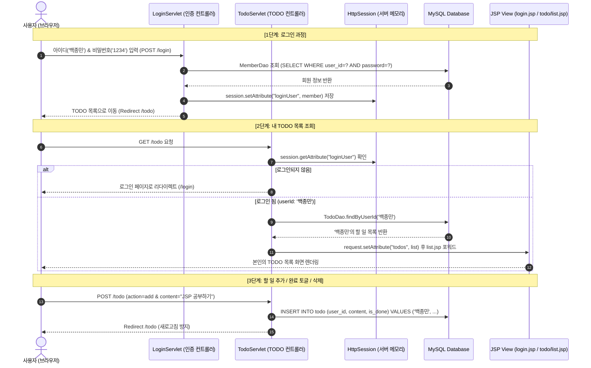

# [초보자 실습 가이드] JSP & Servlet 로그인 연동 TODO LIST 구현하기

이 가이드는 **MySQL JDBC 기반의 웹 프로젝트(`custom_project_jdbc`)**에 **회원 로그인 기능과 사용자별 TODO LIST(할 일 관리) 기능**을 단계별로 추가할 수 있도록 작성된 실습 가이드입니다.

기존 `JSP_LOGIN_GUIDE.md`처럼 기초부터 원리, 코드, 테스트 방법까지 초보자의 눈높이에 맞추어 상세히 설명합니다.

---

## 📌 목차
1. [구현 목표 및 핵심 개념](#1-구현-목표-및-핵심-개념)
2. [전체 동작 흐름 (시퀀스 다이어그램)](#2-전체-동작-흐름-시퀀스-다이어그램)
3. [프로젝트 구조 및 파일 배치도](#3-프로젝트-구조-및-파일-배치도)
4. [Step 0: 데이터베이스 및 테이블 구축 (`sql/todo_schema.sql`)](#step-0-데이터베이스-및-테이블-구축-sqltodo_schemasql)
5. [Step 1: 데이터 모델 (DTO) 작성](#step-1-데이터-모델-dto-작성)
   - 1.1 `Member.java` (회원 정보)
   - 1.2 `TodoItem.java` (할 일 정보)
6. [Step 2: 데이터 접근 객체 (DAO) 작성](#step-2-데이터-접근-객체-dao-작성)
   - 2.1 `MemberDao.java` & `JdbcMemberDao.java`
   - 2.2 `TodoDao.java` & `JdbcTodoDao.java`
7. [Step 3: 비즈니스 로직 (Service) 작성](#step-3-비즈니스-로직-service-작성)
   - 3.1 `MemberService.java`
   - 3.2 `TodoService.java`
8. [Step 4: 컨트롤러 (Servlet) 작성](#step-4-컨트롤러-servlet-작성)
   - 4.1 `LoginServlet.java` (로그인 처리)
   - 4.2 `LogoutServlet.java` (로그아웃 처리)
   - 4.3 `TodoServlet.java` (할 일 CRUD 및 사용자 식별)
9. [Step 5: 화면 뷰 (JSP & CSS) 작성](#step-5-화면-뷰-jsp--css-작성)
   - 5.1 `login.jsp` (로그인 페이지)
   - 5.2 `todo/list.jsp` (할 일 관리 메인 페이지)
   - 5.3 `assets/css/todo.css` (UI 스타일시트)
10. [Step 6: 실행 및 테스트 시나리오](#step-6-실행-및-테스트-시나리오)
11. [자주 묻는 질문 & 트러블슈팅 (FAQ)](#자주-묻는-질문--트러블슈팅-faq)

---

## 1. 구현 목표 및 핵심 개념

### 🎯 주요 요구사항
1. **사용자별 독립된 TODO 관리**:
   - `백종민` 사용자로 로그인하면 `백종민`의 할 일만 표시되고 추가/수정/삭제됩니다.
   - `김유진` 사용자로 로그인하면 `김유진`의 할 일만 표시됩니다.
2. **사전 생성 계정**:
   - 아이디 `백종민` / 비밀번호 `1234`
   - 아이디 `김유진` / 비밀번호 `1234`
3. **핵심 기능**:
   - **조회**: 로그인된 회원의 TODO 목록 최신순 조회
   - **추가**: 새 할 일 등록 (기본값: 미완료)
   - **상태 변경**: 완료 여부 체크박스 토글 (미완료 ↔ 완료)
   - **삭제**: 본인의 할 일 삭제
   - **로그아웃**: 세션 파기 후 로그인 화면으로 이동
4. **아키텍처**:
   - `C:\Users\user\Desktop\custom_project_jdbc`의 기존 구조(`ConnectionProvider`, DAO 인터페이스 + 구현체, Service, Servlet, JSP)를 그대로 계승합니다.

---

## 2. 전체 동작 흐름 (시퀀스 다이어그램)

사용자가 로그인하고 본인의 할 일을 관리하는 전체 흐름입니다.



---

## 3. 프로젝트 구조 및 파일 배치도

`C:\Users\user\Desktop\custom_project_jdbc` 프로젝트에 아래와 같이 파일들을 배치합니다.  
기존 `ConnectionProvider.java`를 그대로 활용하므로 DB 연결 설정이 아주 간편합니다.

```text
custom_project_jdbc/
 ├── sql/
 │    ├── schema.sql              (기존 게시판 테이블)
 │    └── todo_schema.sql         [신규 생성] 회원 및 TODO 테이블 + 테스트 계정
 └── src/
      └── main/
           ├── java/
           │    └── com/kyobo/web/
           │         ├── config/
           │         │    └── ConnectionProvider.java   (기존 DB 연결 클래스 활용)
           │         ├── model/
           │         │    ├── BoardPost.java            (기존 모델)
           │         │    ├── Member.java               [신규 생성] 회원 DTO
           │         │    └── TodoItem.java             [신규 생성] 할 일 DTO
           │         ├── dao/
           │         │    ├── MemberDao.java            [신규 생성] 회원 DAO 인터페이스
           │         │    ├── JdbcMemberDao.java        [신규 생성] 회원 JDBC 구현체
           │         │    ├── TodoDao.java              [신규 생성] 할 일 DAO 인터페이스
           │         │    └── JdbcTodoDao.java          [신규 생성] 할 일 JDBC 구현체
           │         ├── service/
           │         │    ├── MemberService.java        [신규 생성] 로그인 비즈니스 로직
           │         │    └── TodoService.java          [신규 생성] 할 일 비즈니스 로직
           │         └── controller/
           │              ├── BoardServlet.java         (기존 게시판 서블릿)
           │              ├── LoginServlet.java         [신규 생성] 로그인 서블릿 (/login)
           │              ├── LogoutServlet.java        [신규 생성] 로그아웃 서블릿 (/logout)
           │              └── TodoServlet.java          [신규 생성] TODO 관리 서블릿 (/todo)
           └── webapp/
                ├── assets/
                │    └── css/
                │         ├── style.css                 (기존 스타일)
                │         └── todo.css                  [신규 생성] 로그인 & TODO UI 전용 스타일
                └── WEB-INF/
                     └── views/
                          ├── login.jsp                 [신규 생성] 깔끔한 로그인 폼 화면
                          └── todo/
                               └── list.jsp             [신규 생성] 로그인 사용자별 TODO 관리 화면
```

---

## Step 0: 데이터베이스 및 테이블 구축 (`sql/todo_schema.sql`)

MySQL 워크벤치(Workbench)나 CLI에서 실행할 SQL 파일입니다.  
`member` 테이블과 `todo` 테이블을 생성하고, 외래키(`FOREIGN KEY`)로 연결하여 무결성을 보장합니다.

- **파일 위치**: `sql/todo_schema.sql`

```sql
-- 1. 데이터베이스 선택 (ConnectionProvider에서 설정한 kyobo DB 사용)
USE kyobo;

-- 2. 회원 테이블 (member)
CREATE TABLE IF NOT EXISTS member (
    user_id VARCHAR(50) PRIMARY KEY COMMENT '사용자 아이디 (로그인 식별자)',
    password VARCHAR(100) NOT NULL COMMENT '비밀번호',
    name VARCHAR(50) NOT NULL COMMENT '사용자 이름/닉네임',
    created_at TIMESTAMP DEFAULT CURRENT_TIMESTAMP COMMENT '가입일'
);

-- 3. TODO 리스트 테이블 (todo)
CREATE TABLE IF NOT EXISTS todo (
    id BIGINT AUTO_INCREMENT PRIMARY KEY COMMENT '할 일 고유 번호',
    user_id VARCHAR(50) NOT NULL COMMENT '작성자 회원 아이디',
    content VARCHAR(255) NOT NULL COMMENT '할 일 내용',
    is_done BOOLEAN DEFAULT FALSE COMMENT '완료 여부 (0: 미완료, 1: 완료)',
    created_at TIMESTAMP DEFAULT CURRENT_TIMESTAMP COMMENT '등록일',
    CONSTRAINT fk_todo_member FOREIGN KEY (user_id) REFERENCES member(user_id) ON DELETE CASCADE
);

-- 4. 테스트 계정 추가 (아이디: 백종민 / 비밀번호: 1234, 아이디: 김유진 / 비밀번호: 1234)
INSERT INTO member (user_id, password, name)
VALUES 
    ('백종민', '1234', '백종민'),
    ('김유진', '1234', '김유진')
ON DUPLICATE KEY UPDATE name = VALUES(name);

-- 5. 테스트용 초기 TODO 데이터 삽입 (선택 사항)
INSERT INTO todo (user_id, content, is_done)
VALUES 
    ('백종민', '서블릿과 JSP 기초 개념 정리하기', TRUE),
    ('백종민', 'ConnectionProvider로 JDBC 연결 확인하기', FALSE),
    ('김유진', 'MySQL Workbench에서 테이블 생성하기', TRUE),
    ('김유진', 'JSTL c:forEach 문법 복습하기', FALSE);
```

> **💡 테이블 설계 포인트:**
> - `todo` 테이블에 `user_id` 컬럼을 두고, `member(user_id)`를 외래키로 지정했습니다.
> - 따라서 특정 사용자가 로그인하면 `WHERE user_id = ?` 조건으로 **본인의 할 일만 정확하게 필터링**할 수 있습니다.

---

## Step 1: 데이터 모델 (DTO) 작성

데이터베이스의 테이블 레코드 1행을 담아줄 자바 객체입니다.

### 1.1 `Member.java`
- **파일 위치**: `src/main/java/com/kyobo/web/model/Member.java`

```java
package com.kyobo.web.model;

import java.io.Serializable;
import java.time.LocalDateTime;

/**
 * 회원 정보 DTO
 * 세션(HttpSession)에 저장되므로 Serializable을 구현합니다.
 */
public class Member implements Serializable {
    private static final long serialVersionUID = 1L;

    private String userId;
    private String password;
    private String name;
    private LocalDateTime createdAt;

    public Member() {}

    public Member(String userId, String password, String name) {
        this.userId = userId;
        this.password = password;
        this.name = name;
    }

    public String getUserId() {
        return userId;
    }

    public void setUserId(String userId) {
        this.userId = userId;
    }

    public String getPassword() {
        return password;
    }

    public void setPassword(String password) {
        this.password = password;
    }

    public String getName() {
        return name;
    }

    public void setName(String name) {
        this.name = name;
    }

    public LocalDateTime getCreatedAt() {
        return createdAt;
    }

    public void setCreatedAt(LocalDateTime createdAt) {
        this.createdAt = createdAt;
    }
}
```

---

### 1.2 `TodoItem.java`
- **파일 위치**: `src/main/java/com/kyobo/web/model/TodoItem.java`

```java
package com.kyobo.web.model;

import java.time.LocalDateTime;

/**
 * TODO 항목 DTO
 */
public class TodoItem {
    private Long id;
    private String userId;
    private String content;
    private boolean done;
    private LocalDateTime createdAt;

    public TodoItem() {}

    public TodoItem(String userId, String content) {
        this.userId = userId;
        this.content = content;
        this.done = false;
    }

    public Long getId() {
        return id;
    }

    public void setId(Long id) {
        this.id = id;
    }

    public String getUserId() {
        return userId;
    }

    public void setUserId(String userId) {
        this.userId = userId;
    }

    public String getContent() {
        return content;
    }

    public void setContent(String content) {
        this.content = content;
    }

    public boolean isDone() {
        return done;
    }

    public void setDone(boolean done) {
        this.done = done;
    }

    public LocalDateTime getCreatedAt() {
        return createdAt;
    }

    public void setCreatedAt(LocalDateTime createdAt) {
        this.createdAt = createdAt;
    }
}
```

---

## Step 2: 데이터 접근 객체 (DAO) 작성

`ConnectionProvider`를 사용하여 데이터베이스에 SQL을 전송하고 결과를 받아오는 계층입니다.

### 2.1 회원 DAO: `MemberDao.java` & `JdbcMemberDao.java`

- **인터페이스 위치**: `src/main/java/com/kyobo/web/dao/MemberDao.java`

```java
package com.kyobo.web.dao;

import com.kyobo.web.model.Member;
import java.sql.SQLException;
import java.util.Optional;

public interface MemberDao {
    Optional<Member> findById(String userId) throws SQLException;
    Optional<Member> findByIdAndPassword(String userId, String password) throws SQLException;
}
```

- **구현체 위치**: `src/main/java/com/kyobo/web/dao/JdbcMemberDao.java`

```java
package com.kyobo.web.dao;

import com.kyobo.web.config.ConnectionProvider;
import com.kyobo.web.model.Member;

import java.sql.*;
import java.util.Optional;

public class JdbcMemberDao implements MemberDao {

    private Member map(ResultSet rs) throws SQLException {
        Member m = new Member();
        m.setUserId(rs.getString("user_id"));
        m.setPassword(rs.getString("password"));
        m.setName(rs.getString("name"));
        Timestamp ts = rs.getTimestamp("created_at");
        if (ts != null) {
            m.setCreatedAt(ts.toLocalDateTime());
        }
        return m;
    }

    @Override
    public Optional<Member> findById(String userId) throws SQLException {
        String sql = "SELECT user_id, password, name, created_at FROM member WHERE user_id = ?";
        try (Connection conn = ConnectionProvider.getConnection();
             PreparedStatement ps = conn.prepareStatement(sql)) {
            ps.setString(1, userId);
            try (ResultSet rs = ps.executeQuery()) {
                return rs.next() ? Optional.of(map(rs)) : Optional.empty();
            }
        }
    }

    @Override
    public Optional<Member> findByIdAndPassword(String userId, String password) throws SQLException {
        String sql = "SELECT user_id, password, name, created_at FROM member WHERE user_id = ? AND password = ?";
        try (Connection conn = ConnectionProvider.getConnection();
             PreparedStatement ps = conn.prepareStatement(sql)) {
            ps.setString(1, userId);
            ps.setString(2, password);
            try (ResultSet rs = ps.executeQuery()) {
                return rs.next() ? Optional.of(map(rs)) : Optional.empty();
            }
        }
    }
}
```

---

### 2.2 할 일 DAO: `TodoDao.java` & `JdbcTodoDao.java`

- **인터페이스 위치**: `src/main/java/com/kyobo/web/dao/TodoDao.java`

```java
package com.kyobo.web.dao;

import com.kyobo.web.model.TodoItem;
import java.sql.SQLException;
import java.util.List;

public interface TodoDao {
    List<TodoItem> findByUserId(String userId) throws SQLException;
    long insert(TodoItem item) throws SQLException;
    boolean toggleDone(long id, String userId) throws SQLException;
    boolean delete(long id, String userId) throws SQLException;
}
```

- **구현체 위치**: `src/main/java/com/kyobo/web/dao/JdbcTodoDao.java`

```java
package com.kyobo.web.dao;

import com.kyobo.web.config.ConnectionProvider;
import com.kyobo.web.model.TodoItem;

import java.sql.*;
import java.util.ArrayList;
import java.util.List;

public class JdbcTodoDao implements TodoDao {

    private TodoItem map(ResultSet rs) throws SQLException {
        TodoItem item = new TodoItem();
        item.setId(rs.getLong("id"));
        item.setUserId(rs.getString("user_id"));
        item.setContent(rs.getString("content"));
        item.setDone(rs.getBoolean("is_done"));
        Timestamp ts = rs.getTimestamp("created_at");
        if (ts != null) {
            item.setCreatedAt(ts.toLocalDateTime());
        }
        return item;
    }

    @Override
    public List<TodoItem> findByUserId(String userId) throws SQLException {
        String sql = "SELECT id, user_id, content, is_done, created_at FROM todo WHERE user_id = ? ORDER BY id DESC";
        List<TodoItem> list = new ArrayList<>();
        try (Connection conn = ConnectionProvider.getConnection();
             PreparedStatement ps = conn.prepareStatement(sql)) {
            ps.setString(1, userId);
            try (ResultSet rs = ps.executeQuery()) {
                while (rs.next()) {
                    list.add(map(rs));
                }
            }
        }
        return list;
    }

    @Override
    public long insert(TodoItem item) throws SQLException {
        String sql = "INSERT INTO todo (user_id, content, is_done) VALUES (?, ?, ?)";
        try (Connection conn = ConnectionProvider.getConnection();
             PreparedStatement ps = conn.prepareStatement(sql, Statement.RETURN_GENERATED_KEYS)) {
            ps.setString(1, item.getUserId());
            ps.setString(2, item.getContent());
            ps.setBoolean(3, item.isDone());
            ps.executeUpdate();

            try (ResultSet rs = ps.getGeneratedKeys()) {
                if (rs.next()) {
                    return rs.getLong(1);
                }
            }
        }
        return 0;
    }

    @Override
    public boolean toggleDone(long id, String userId) throws SQLException {
        // 보안 검증: 다른 사람의 할 일을 수정할 수 없도록 user_id 조건을 반드시 포함합니다!
        String sql = "UPDATE todo SET is_done = NOT is_done WHERE id = ? AND user_id = ?";
        try (Connection conn = ConnectionProvider.getConnection();
             PreparedStatement ps = conn.prepareStatement(sql)) {
            ps.setLong(1, id);
            ps.setString(2, userId);
            return ps.executeUpdate() == 1;
        }
    }

    @Override
    public boolean delete(long id, String userId) throws SQLException {
        // 보안 검증: 다른 사람의 할 일을 삭제할 수 없도록 user_id 조건을 반드시 포함합니다!
        String sql = "DELETE FROM todo WHERE id = ? AND user_id = ?";
        try (Connection conn = ConnectionProvider.getConnection();
             PreparedStatement ps = conn.prepareStatement(sql)) {
            ps.setLong(1, id);
            ps.setString(2, userId);
            return ps.executeUpdate() == 1;
        }
    }
}
```

> **🔒 보안 팁 (데이터 격리)**:  
> `toggleDone()`과 `delete()` 메서드를 보면 SQL 조건에 `WHERE id = ? AND user_id = ?`로 `user_id`를 함께 넣었습니다.  
> 이렇게 하면 URL 파라미터를 임의로 조작하더라도 다른 회원의 TODO를 건드릴 수 없습니다.

---

## Step 3: 비즈니스 로직 (Service) 작성

서블릿과 DAO 사이에 위치하여 유효성 검증과 비즈니스 로직을 처리하는 계층입니다.

### 3.1 `MemberService.java`
- **파일 위치**: `src/main/java/com/kyobo/web/service/MemberService.java`

```java
package com.kyobo.web.service;

import com.kyobo.web.dao.MemberDao;
import com.kyobo.web.model.Member;

import java.util.Optional;

public class MemberService {
    private final MemberDao memberDao;

    public MemberService(MemberDao memberDao) {
        this.memberDao = memberDao;
    }

    /**
     * 로그인 검증 메서드
     */
    public Member login(String userId, String password) throws Exception {
        if (userId == null || userId.isBlank() || password == null || password.isBlank()) {
            throw new IllegalArgumentException("아이디와 비밀번호를 모두 입력해주세요.");
        }

        Optional<Member> memberOpt = memberDao.findByIdAndPassword(userId.trim(), password.trim());
        return memberOpt.orElse(null); // 일치하는 회원이 없으면 null 반환
    }
}
```

---

### 3.2 `TodoService.java`
- **파일 위치**: `src/main/java/com/kyobo/web/service/TodoService.java`

```java
package com.kyobo.web.service;

import com.kyobo.web.dao.TodoDao;
import com.kyobo.web.model.TodoItem;

import java.util.List;

public class TodoService {
    private final TodoDao todoDao;

    public TodoService(TodoDao todoDao) {
        this.todoDao = todoDao;
    }

    public List<TodoItem> getTodoList(String userId) throws Exception {
        return todoDao.findByUserId(userId);
    }

    public long addTodo(String userId, String content) throws Exception {
        if (content == null || content.isBlank()) {
            throw new IllegalArgumentException("할 일 내용을 입력해주세요.");
        }
        TodoItem item = new TodoItem(userId, content.trim());
        return todoDao.insert(item);
    }

    public void toggleStatus(long id, String userId) throws Exception {
        boolean updated = todoDao.toggleDone(id, userId);
        if (!updated) {
            throw new IllegalStateException("해당 할 일을 찾을 수 없거나 수정 권한이 없습니다.");
        }
    }

    public void removeTodo(long id, String userId) throws Exception {
        boolean deleted = todoDao.delete(id, userId);
        if (!deleted) {
            throw new IllegalStateException("해당 할 일을 찾을 수 없거나 삭제 권한이 없습니다.");
        }
    }
}
```

---

## Step 4: 컨트롤러 (Servlet) 작성

브라우저의 요청을 받아 Service를 호출하고 JSP 화면으로 연결해 주는 서블릿입니다.

### 4.1 `LoginServlet.java` (로그인 컨트롤러)
- **URL 매핑**: `/login`
- **파일 위치**: `src/main/java/com/kyobo/web/controller/LoginServlet.java`

```java
package com.kyobo.web.controller;

import com.kyobo.web.dao.JdbcMemberDao;
import com.kyobo.web.model.Member;
import com.kyobo.web.service.MemberService;
import jakarta.servlet.ServletException;
import jakarta.servlet.annotation.WebServlet;
import jakarta.servlet.http.HttpServlet;
import jakarta.servlet.http.HttpServletRequest;
import jakarta.servlet.http.HttpServletResponse;
import jakarta.servlet.http.HttpSession;

import java.io.IOException;

@WebServlet("/login")
public class LoginServlet extends HttpServlet {
    private MemberService memberService;

    @Override
    public void init() {
        memberService = new MemberService(new JdbcMemberDao());
    }

    /**
     * GET 요청: 로그인 화면 보여주기
     */
    @Override
    protected void doGet(HttpServletRequest req, HttpServletResponse res) throws ServletException, IOException {
        // 이미 로그인되어 있으면 곧바로 TODO 목록으로 이동
        HttpSession session = req.getSession(false);
        if (session != null && session.getAttribute("loginUser") != null) {
            res.sendRedirect(req.getContextPath() + "/todo");
            return;
        }

        // 로그인 폼 JSP로 이동
        req.getRequestDispatcher("/WEB-INF/views/login.jsp").forward(req, res);
    }

    /**
     * POST 요청: 아이디/비밀번호 검증 및 세션 생성
     */
    @Override
    protected void doPost(HttpServletRequest req, HttpServletResponse res) throws ServletException, IOException {
        req.setCharacterEncoding("UTF-8");

        String userId = req.getParameter("userId");
        String password = req.getParameter("password");

        try {
            Member member = memberService.login(userId, password);

            if (member != null) {
                // 로그인 성공 -> 세션에 저장
                HttpSession session = req.getSession(true);
                session.setAttribute("loginUser", member);
                session.setMaxInactiveInterval(1800); // 30분 유지

                // TODO 목록으로 리다이렉트
                res.sendRedirect(req.getContextPath() + "/todo");
            } else {
                // 로그인 실패
                req.setAttribute("errorMessage", "아이디 또는 비밀번호가 올바르지 않습니다.");
                req.getRequestDispatcher("/WEB-INF/views/login.jsp").forward(req, res);
            }
        } catch (IllegalArgumentException e) {
            req.setAttribute("errorMessage", e.getMessage());
            req.getRequestDispatcher("/WEB-INF/views/login.jsp").forward(req, res);
        } catch (Exception e) {
            throw new ServletException("로그인 처리 중 오류가 발생했습니다.", e);
        }
    }
}
```

---

### 4.2 `LogoutServlet.java` (로그아웃 컨트롤러)
- **URL 매핑**: `/logout`
- **파일 위치**: `src/main/java/com/kyobo/web/controller/LogoutServlet.java`

```java
package com.kyobo.web.controller;

import jakarta.servlet.ServletException;
import jakarta.servlet.annotation.WebServlet;
import jakarta.servlet.http.HttpServlet;
import jakarta.servlet.http.HttpServletRequest;
import jakarta.servlet.http.HttpServletResponse;
import jakarta.servlet.http.HttpSession;

import java.io.IOException;

@WebServlet("/logout")
public class LogoutServlet extends HttpServlet {

    @Override
    protected void doGet(HttpServletRequest req, HttpServletResponse res) throws ServletException, IOException {
        HttpSession session = req.getSession(false);
        if (session != null) {
            session.invalidate(); // 세션 삭제
        }
        res.sendRedirect(req.getContextPath() + "/login");
    }

    @Override
    protected void doPost(HttpServletRequest req, HttpServletResponse res) throws ServletException, IOException {
        doGet(req, res);
    }
}
```

---

### 4.3 `TodoServlet.java` (TODO 메인 컨트롤러)
- **URL 매핑**: `/todo`
- **파일 위치**: `src/main/java/com/kyobo/web/controller/TodoServlet.java`

```java
package com.kyobo.web.controller;

import com.kyobo.web.dao.JdbcTodoDao;
import com.kyobo.web.model.Member;
import com.kyobo.web.service.TodoService;
import jakarta.servlet.ServletException;
import jakarta.servlet.annotation.WebServlet;
import jakarta.servlet.http.HttpServlet;
import jakarta.servlet.http.HttpServletRequest;
import jakarta.servlet.http.HttpServletResponse;
import jakarta.servlet.http.HttpSession;

import java.io.IOException;

@WebServlet("/todo")
public class TodoServlet extends HttpServlet {
    private TodoService todoService;

    @Override
    public void init() {
        todoService = new TodoService(new JdbcTodoDao());
    }

    /**
     * GET 요청: 현재 로그인한 사용자의 TODO 목록 조회
     */
    @Override
    protected void doGet(HttpServletRequest req, HttpServletResponse res) throws ServletException, IOException {
        Member loginUser = getLoginUser(req);
        if (loginUser == null) {
            // 로그인되어 있지 않으면 로그인 페이지로 보냄
            res.sendRedirect(req.getContextPath() + "/login");
            return;
        }

        try {
            // 로그인한 사용자의 아이디로 할 일 목록 가져오기
            req.setAttribute("todos", todoService.getTodoList(loginUser.getUserId()));
            req.getRequestDispatcher("/WEB-INF/views/todo/list.jsp").forward(req, res);
        } catch (Exception e) {
            throw new ServletException(e);
        }
    }

    /**
     * POST 요청: 추가(add), 토글(toggle), 삭제(delete) 동작 처리
     */
    @Override
    protected void doPost(HttpServletRequest req, HttpServletResponse res) throws ServletException, IOException {
        req.setCharacterEncoding("UTF-8");

        Member loginUser = getLoginUser(req);
        if (loginUser == null) {
            res.sendRedirect(req.getContextPath() + "/login");
            return;
        }

        String action = req.getParameter("action");
        String currentUserId = loginUser.getUserId();

        try {
            if ("add".equals(action)) {
                String content = req.getParameter("content");
                todoService.addTodo(currentUserId, content);
            } else if ("toggle".equals(action)) {
                long id = Long.parseLong(req.getParameter("id"));
                todoService.toggleStatus(id, currentUserId);
            } else if ("delete".equals(action)) {
                long id = Long.parseLong(req.getParameter("id"));
                todoService.removeTodo(id, currentUserId);
            }

            // 작업 완료 후 목록으로 리다이렉트 (새로고침 시 중복 요청 방지 - PRG 패턴)
            res.sendRedirect(req.getContextPath() + "/todo");
        } catch (IllegalArgumentException e) {
            req.getSession().setAttribute("flashError", e.getMessage());
            res.sendRedirect(req.getContextPath() + "/todo");
        } catch (Exception e) {
            throw new ServletException(e);
        }
    }

    /**
     * 세션에서 로그인된 사용자 정보를 꺼내는 헬퍼 메서드
     */
    private Member getLoginUser(HttpServletRequest req) {
        HttpSession session = req.getSession(false);
        if (session != null) {
            return (Member) session.getAttribute("loginUser");
        }
        return null;
    }
}
```

---

## Step 5: 화면 뷰 (JSP & CSS) 작성

로그인 폼과 TODO 리스트를 직관적이고 깔끔하게 보여주는 UI를 작성합니다.

### 5.1 UI 전용 스타일시트 (`assets/css/todo.css`)
- **파일 위치**: `src/main/webapp/assets/css/todo.css`

```css
/* 전역 기본 스타일 */
* {
    box-sizing: border-box;
    margin: 0;
    padding: 0;
}

body {
    font-family: -apple-system, BlinkMacSystemFont, "Segoe UI", Roboto, "Noto Sans KR", sans-serif;
    background-color: #f4f6f9;
    color: #2c3e50;
    min-height: 100vh;
    display: flex;
    justify-content: center;
    align-items: center;
    padding: 20px;
}

/* 카드 컨테이너 */
.app-card {
    background: #ffffff;
    width: 100%;
    max-width: 480px;
    border-radius: 12px;
    box-shadow: 0 8px 24px rgba(149, 157, 165, 0.2);
    overflow: hidden;
    padding: 32px 28px;
}

/* 헤더 영역 */
.app-header {
    margin-bottom: 24px;
    text-align: center;
}

.app-title {
    font-size: 24px;
    font-weight: 700;
    color: #1a202c;
    margin-bottom: 8px;
}

.app-subtitle {
    font-size: 14px;
    color: #718096;
}

/* 사용자 정보 바 */
.user-bar {
    display: flex;
    justify-content: space-between;
    align-items: center;
    background: #edf2f7;
    padding: 10px 16px;
    border-radius: 8px;
    margin-bottom: 20px;
}

.user-badge {
    font-size: 14px;
    font-weight: 600;
    color: #2d3748;
}

.user-badge span {
    color: #3182ce;
}

.btn-logout {
    font-size: 12px;
    color: #e53e3e;
    text-decoration: none;
    font-weight: 600;
    border: 1px solid #feb2b2;
    padding: 4px 8px;
    border-radius: 4px;
    background: #fff;
    transition: all 0.2s;
}

.btn-logout:hover {
    background: #e53e3e;
    color: #fff;
}

/* 폼 스타일 */
.form-group {
    margin-bottom: 16px;
}

.form-label {
    display: block;
    font-size: 13px;
    font-weight: 600;
    margin-bottom: 6px;
    color: #4a5568;
}

.form-input {
    width: 100%;
    padding: 10px 14px;
    border: 1px solid #cbd5e0;
    border-radius: 6px;
    font-size: 14px;
    outline: none;
    transition: border-color 0.2s;
}

.form-input:focus {
    border-color: #3182ce;
    box-shadow: 0 0 0 3px rgba(49, 130, 206, 0.15);
}

.btn-primary {
    width: 100%;
    padding: 12px;
    background-color: #3182ce;
    color: #ffffff;
    border: none;
    border-radius: 6px;
    font-size: 15px;
    font-weight: 600;
    cursor: pointer;
    transition: background-color 0.2s;
}

.btn-primary:hover {
    background-color: #2b6cb0;
}

/* TODO 입력 인풋바 */
.todo-input-form {
    display: flex;
    gap: 8px;
    margin-bottom: 24px;
}

.todo-input-form input {
    flex: 1;
}

.btn-add {
    padding: 0 18px;
    background-color: #3182ce;
    color: white;
    border: none;
    border-radius: 6px;
    font-weight: 600;
    cursor: pointer;
}

.btn-add:hover {
    background-color: #2b6cb0;
}

/* TODO 목록 리스트 */
.todo-list {
    list-style: none;
}

.todo-item {
    display: flex;
    align-items: center;
    justify-content: space-between;
    padding: 12px;
    background: #f7fafc;
    border: 1px solid #edf2f7;
    border-radius: 8px;
    margin-bottom: 10px;
    transition: background-color 0.2s;
}

.todo-item:hover {
    background: #edf2f7;
}

.todo-content-box {
    display: flex;
    align-items: center;
    gap: 12px;
    flex: 1;
}

.todo-checkbox-btn {
    background: none;
    border: none;
    cursor: pointer;
    font-size: 18px;
    line-height: 1;
}

.todo-text {
    font-size: 14px;
    color: #2d3748;
    word-break: break-all;
}

/* 완료된 상태 스타일 (취소선 & 흐리게) */
.todo-item.done .todo-text {
    text-decoration: line-through;
    color: #a0aec0;
}

.btn-delete {
    background: none;
    border: none;
    color: #a0aec0;
    cursor: pointer;
    font-size: 16px;
    padding: 4px;
    transition: color 0.2s;
}

.btn-delete:hover {
    color: #e53e3e;
}

/* 빈 목록 알림 */
.empty-state {
    text-align: center;
    padding: 30px 10px;
    color: #a0aec0;
    font-size: 14px;
}

/* 에러 메시지 */
.error-box {
    background-color: #fff5f5;
    color: #c53030;
    padding: 10px;
    border-radius: 6px;
    font-size: 13px;
    margin-bottom: 16px;
    text-align: center;
    border: 1px solid #fed7d7;
}

/* 힌트 박스 */
.hint-box {
    margin-top: 20px;
    background-color: #f7fafc;
    padding: 12px;
    border-radius: 6px;
    font-size: 12px;
    color: #718096;
    line-height: 1.5;
}
```

---

### 5.2 `login.jsp` (로그인 폼 화면)
- **파일 위치**: `src/main/webapp/WEB-INF/views/login.jsp`
- `jakarta.tags.core` JSTL 라이브러리를 사용하여 에러 메시지를 깔끔하게 렌더링합니다.

```jsp
<%@ page contentType="text/html; charset=UTF-8" pageEncoding="UTF-8" %>
<%@ taglib prefix="c" uri="jakarta.tags.core" %>

<!DOCTYPE html>
<html lang="ko">
<head>
    <meta charset="UTF-8">
    <title>로그인 - TODO 서비스</title>
    <link rel="stylesheet" href="${pageContext.request.contextPath}/assets/css/todo.css">
</head>
<body>

<div class="app-card">
    <div class="app-header">
        <h1 class="app-title">TODO LIST</h1>
        <p class="app-subtitle">로그인하여 본인의 할 일 목록을 관리하세요</p>
    </div>

    <!-- 에러 메시지 표시 -->
    <c:if test="${not empty errorMessage}">
        <div class="error-box">
            ${errorMessage}
        </div>
    </c:if>

    <form action="${pageContext.request.contextPath}/login" method="post">
        <div class="form-group">
            <label class="form-label" for="userId">아이디</label>
            <input class="form-input" type="text" id="userId" name="userId" required placeholder="아이디를 입력하세요">
        </div>

        <div class="form-group">
            <label class="form-label" for="password">비밀번호</label>
            <input class="form-input" type="password" id="password" name="password" required placeholder="비밀번호를 입력하세요">
        </div>

        <button type="submit" class="btn-primary">로그인</button>
    </form>

    <div class="hint-box">
        <strong>💡 테스트 계정 안내:</strong><br>
        - 아이디: <code>백종민</code> / 비밀번호: <code>1234</code><br>
        - 아이디: <code>김유진</code> / 비밀번호: <code>1234</code>
    </div>
</div>

</body>
</html>
```

---

### 5.3 `todo/list.jsp` (할 일 관리 화면)
- **파일 위치**: `src/main/webapp/WEB-INF/views/todo/list.jsp`
- 체크박스 클릭 시 바로 상태를 반전(토글)시키며, 삭제 버튼 클릭 시 항목을 삭제합니다.

```jsp
<%@ page contentType="text/html; charset=UTF-8" pageEncoding="UTF-8" %>
<%@ taglib prefix="c" uri="jakarta.tags.core" %>

<!DOCTYPE html>
<html lang="ko">
<head>
    <meta charset="UTF-8">
    <title>내 할 일 목록 - TODO LIST</title>
    <link rel="stylesheet" href="${pageContext.request.contextPath}/assets/css/todo.css">
</head>
<body>

<div class="app-card">
    <!-- 헤더 및 사용자 식별 영역 -->
    <div class="user-bar">
        <div class="user-badge">
            👤 <span>${sessionScope.loginUser.name}</span>님의 TODO
        </div>
        <a href="${pageContext.request.contextPath}/logout" class="btn-logout">로그아웃</a>
    </div>

    <!-- 임시 에러 메시지(Flash message) 표시 -->
    <c:if test="${not empty sessionScope.flashError}">
        <div class="error-box">
            ${sessionScope.flashError}
        </div>
        <c:remove var="flashError" scope="session"/>
    </c:if>

    <!-- 할 일 등록 폼 -->
    <form class="todo-input-form" action="${pageContext.request.contextPath}/todo" method="post">
        <input type="hidden" name="action" value="add">
        <input class="form-input" type="text" name="content" placeholder="새로운 할 일을 입력하세요..." required autofocus>
        <button type="submit" class="btn-add">추가</button>
    </form>

    <!-- 할 일 목록 출력 -->
    <ul class="todo-list">
        <c:forEach var="todo" items="${todos}">
            <li class="todo-item ${todo.done ? 'done' : ''}">
                <div class="todo-content-box">
                    <!-- 완료 토글 버튼 (클릭 시 POST form 자동 제출) -->
                    <form action="${pageContext.request.contextPath}/todo" method="post" style="display:inline;">
                        <input type="hidden" name="action" value="toggle">
                        <input type="hidden" name="id" value="${todo.id}">
                        <button type="submit" class="todo-checkbox-btn" title="상태 변경">
                            ${todo.done ? '✅' : '⬜'}
                        </button>
                    </form>

                    <!-- 할 일 내용 -->
                    <span class="todo-text">${todo.content}</span>
                </div>

                <!-- 삭제 버튼 -->
                <form action="${pageContext.request.contextPath}/todo" method="post" style="display:inline;" onsubmit="return confirm('정말 삭제하시겠습니까?');">
                    <input type="hidden" name="action" value="delete">
                    <input type="hidden" name="id" value="${todo.id}">
                    <button type="submit" class="btn-delete" title="삭제">🗑️</button>
                </form>
            </li>
        </c:forEach>
    </ul>

    <!-- 할 일이 하나도 없을 때 -->
    <c:if test="${empty todos}">
        <div class="empty-state">
            아직 등록된 할 일이 없습니다.<br>오늘 해야 할 일을 등록해보세요!
        </div>
    </c:if>
</div>

</body>
</html>
```

---

## Step 6: 실행 및 테스트 시나리오

모든 코드를 작성했다면 이제 테스트를 진행합니다.

### 1. DB 스크립트 실행
- MySQL Workbench 등에서 `sql/todo_schema.sql` 내용을 실행하여 `member`와 `todo` 테이블을 생성합니다.

### 2. 톰캣(Tomcat) 서버 구동
- IntelliJ IDEA의 Smart Tomcat 또는 Gradle Run으로 서버를 시작합니다.

### 3. 테스트 시나리오 진행

```text
[시나리오 1: 비로그인 접근 차단]
1. 브라우저에서 http://localhost:8080/custom_project_jdbc/todo 접속
2. 결과: 세션이 없으므로 자동으로 http://localhost:8080/custom_project_jdbc/login 으로 리다이렉트됨

[시나리오 2: 백종민 로그인 및 할 일 관리]
1. 아이디 '백종민', 비밀번호 '1234' 입력 후 로그인 버튼 클릭
2. 상단에 '👤 백종민님의 TODO' 표시 확인
3. '백종민'의 기존 할 일 리스트가 나타나는지 확인
4. 할 일 입력창에 "JDBC 실습 완료하기" 입력 후 [추가] 클릭 -> 목록 최상단에 추가됨
5. 체크박스(⬜) 클릭 -> 체크 표시(✅)로 바뀌고 텍스트에 취소선이 그어지는지 확인
6. [우측 상단 로그아웃] 클릭 -> 로그인 페이지로 복귀

[시나리오 3: 김유진 로그인 및 데이터 격리 검증]
1. 아이디 '김유진', 비밀번호 '1234' 입력 후 로그인
2. 상단에 '👤 김유진님의 TODO' 표시 확인
3. 방금 '백종민' 계정에서 추가한 "JDBC 실습 완료하기"는 보이지 않고, 오직 '김유진'의 할 일만 노출되는지 확인
4. 정상적으로 사용자별 TODO가 분리되어 있으면 완벽히 성공!
```

---

## 자주 묻는 질문 & 트러블슈팅 (FAQ)

### Q1. 한글 아이디(`백종민`, `김유진`)로 로그인할 때 일치하지 않는다고 나와요.
- **원인**: 서블릿 요청 시 한글 인코딩이 깨진 상태로 파라미터를 읽어왔기 때문입니다.
- **해결**: 모든 서블릿의 `doPost()` 첫 줄에 반드시 아래 코드가 있는지 확인하세요:
  ```java
  req.setCharacterEncoding("UTF-8");
  ```
- 또한 `ConnectionProvider`의 JDBC URL에 `characterEncoding=UTF-8` 옵션이 들어가 있는지 확인하세요.

### Q2. `c:forEach` 태그나 `${todos}` EL 표현식이 브라우저에 그대로 글자로 나와요.
- **원인**: JSP 파일 상단에 Jakarta용 JSTL 태그 라이브러리 지시자가 누락되었거나 버전이 맞지 않는 경우입니다.
- **해결**: JSP 최상단에 아래 코드가 정확히 선언되어 있어야 합니다.
  ```jsp
  <%@ taglib prefix="c" uri="jakarta.tags.core" %>
  ```
  *(과거 버전의 `http://java.sun.com/jsp/jstl/core`가 아니라 **`jakarta.tags.core`**여야 합니다!)*

### Q3. "다른 사람의 TODO를 수정하거나 지울 수 없나요?"
- **답변**: 본 가이드의 `JdbcTodoDao`에서는 `UPDATE`와 `DELETE` 쿼리에 다음과 같이 조건을 걸었습니다:
  ```sql
  WHERE id = ? AND user_id = ?
  ```
  따라서 악의적인 사용자가 다른 사람의 `id`를 가로채서 요청하더라도, 세션에 저장된 본인의 `user_id`와 일치하지 않으면 쿼리가 적용되지 않아 안전합니다.

### Q4. 세션 타임아웃은 어떻게 조절하나요?
- `LoginServlet.java`에서 `session.setMaxInactiveInterval(1800);`로 30분(1800초) 설정되어 있습니다. 원하는 시간(초)으로 변경할 수 있습니다.
