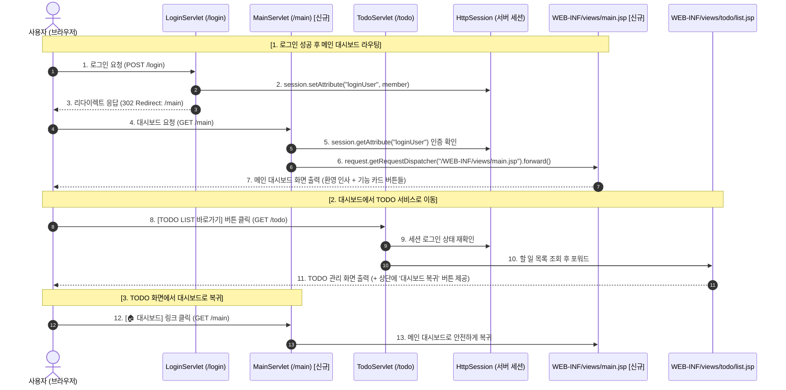

# [실습 가이드] 로그인 후 메인 대시보드(기능 선택 화면) 라우팅 흐름 구현하기

이 가이드는 **로그인 완료 후 특정 단일 기능(TODO 리스트)으로 곧바로 이동하던 기존 라우팅 구조를 개선**하여,  
사용자가 로그인 후 **'메인 대시보드(기능 선택 화면)'**를 먼저 마주하고, 대시보드에서 원하는 서비스(TODO 리스트, 게시판 등)를 선택하여 이동할 수 있도록 **웹 애플리케이션의 MVC 라우팅 아키텍처를 확장하는 단계별 가이드**입니다.

> 💡 **수석 개발자의 아키텍처 노트**:  
> 실무 웹 애플리케이션은 지속적으로 기능(게시판, 마이페이지, 통계 등)이 확장됩니다. 로그인 성공 시 특정 세부 기능으로 직행하기보다는 **중앙 대시보드(Gateway Controller)**를 거치도록 설계하면, 사용자 경험(UX)이 향상될 뿐만 아니라 향후 새로운 기능이 추가될 때 메뉴 확장과 권한 제어가 매우 유연해집니다.

---

## 📌 목차
1. [라우팅 아키텍처 개선 배경 및 새로운 흐름 정의](#1-라우팅-아키텍처-개선-배경-및-새로운-흐름-정의)
2. [전체 동작 흐름 (시퀀스 다이어그램)](#2-전체-동작-흐름-시퀀스-다이어그램)
3. [프로젝트 구조 및 작업 파일 배치도](#3-프로젝트-구조-및-작업-파일-배치도)
4. [Step 1: [신규 생성] 메인 대시보드 컨트롤러 (`MainServlet.java`)](#step-1-신규-생성-메인-대시보드-컨트롤러-mainservletjava)
5. [Step 2: [신규/개편] 메인 대시보드 화면 (`WEB-INF/views/main.jsp`)](#step-2-신규개편-메인-대시보드-화면-web-infviewsmainjsp)
6. [Step 3: [기존 수정] 로그인 서블릿 라우팅 변경 (`LoginServlet.java`)](#step-3-기존-수정-로그인-서블릿-라우팅-변경-loginservletjava)
7. [Step 4: [기존 수정] TODO 화면에 '대시보드로 돌아가기' 버튼 추가 (`todo/list.jsp`)](#step-4-기존-수정-todo-화면에-대시보드로-돌아가기-버튼-추가-todolistjsp)
8. [Step 5: 실행 및 동작 테스트 시나리오](#step-5-실행-및-동작-테스트-시나리오)
9. [자주 묻는 질문 & 아키텍처 점검 (FAQ)](#자주-묻는-질문--아키텍처-점검-faq)

---

## 1. 라우팅 아키텍처 개선 배경 및 새로운 흐름 정의

### 🔄 기존 흐름 (Single-Service Routing)
```text
[로그인 성공] ──(Redirect)──> [/todo (TodoServlet)] ──(Forward)──> [할 일 목록 (list.jsp)]
```
* **한계점**: 로그인하자마자 곧바로 할 일 목록 페이지만 보이기 때문에, 게시판이나 회원정보 같은 다른 메뉴로 이동할 수 있는 통로가 부재합니다.

### 🚀 개선된 새로운 흐름 (Dashboard Gateway Routing)
```text
[로그인 성공] 
      │
      ▼ (Redirect: /main)
[MainServlet] ──(Forward)──> [메인 대시보드 뷰 (main.jsp)]
                                   │
                ┌──────────────────┴──────────────────┐
                ▼ (클릭)                              ▼ (클릭)
       [/todo (TodoServlet)]                 [/board (BoardServlet)]
                │                                     │
                ▼ (Forward)                           ▼ (Forward)
      [할 일 목록 (list.jsp)]                 [게시판 목록 (list.jsp)]
```
1. **로그인 완료 (`POST /login`)**: 아이디/비밀번호 인증 성공 시 세션을 발급하고, 브라우저를 **`/main`**으로 리다이렉트합니다.
2. **대시보드 진입 (`GET /main`)**: `MainServlet`이 세션 존재 여부를 검증한 뒤, 대시보드 전용 뷰(`WEB-INF/views/main.jsp`)로 포워드합니다.
3. **기능 선택 (Navigation)**: 대시보드에 배치된 카드형 버튼을 통해 원하는 서비스(`/todo`, `/board` 등)로 이동합니다.
4. **대시보드 복귀**: 각 기능 화면(예: TODO 목록) 상단에 [대시보드 홈] 버튼을 두어 언제든 메인으로 돌아올 수 있게 합니다.

---

## 2. 전체 동작 흐름 (시퀀스 다이어그램)



---

## 3. 프로젝트 구조 및 작업 파일 배치도

작업 대상 파일은 총 4개(신규 생성 2개, 기존 수정 2개)입니다.

```text
Survlet_practice/
 └── src/
      └── main/
           ├── java/
           │    └── com/kyobo/web/
           │         └── controller/
           │              ├── LoginServlet.java     [기존 수정] 로그인 성공 시 이동 경로를 /main으로 변경
           │              ├── MainServlet.java      [신규 생성] 대시보드 접근 제어 및 뷰 포워딩 컨트롤러
           │              └── TodoServlet.java      (기존 유지)
           └── webapp/
                └── WEB-INF/
                     └── views/
                          ├── login.jsp             (기존 유지)
                          ├── main.jsp              [신규 생성] 기능 선택 대시보드 화면 (보호 구역)
                          └── todo/
                               └── list.jsp         [기존 수정] 상단에 '대시보드로 돌아가기' 버튼 추가
```

> **🔒 보안 아키텍처 포인트 (`WEB-INF/views` 배치 이유)**:  
> `main.jsp`를 `webapp/` 루트가 아니라 `webapp/WEB-INF/views/` 아래에 배치하면, 비로그인 사용자가 브라우저 주소창에 `http://localhost:8080/Survlet_practice/main.jsp`를 직접 입력하여 접근하는 것을 톰캣 수준에서 원천 차단할 수 있습니다. 오직 `MainServlet`을 통해서만 세션 검증을 거쳐 안전하게 화면을 열 수 있습니다.

---

## Step 1: [신규 생성] 메인 대시보드 컨트롤러 (`MainServlet.java`)

### 📌 파일 역할
- **URL 매핑**: `@WebServlet("/main")`
- **역할**: 대시보드 페이지 접근 시 세션을 검사하여, 미로그인 사용자는 로그인 화면으로 리다이렉트하고, 인증된 사용자만 `WEB-INF/views/main.jsp`로 포워딩해 주는 **게이트웨이 컨트롤러**입니다.

- **파일 생성 위치**: `src/main/java/com/kyobo/web/controller/MainServlet.java`

```java
package com.kyobo.web.controller;

import com.kyobo.web.model.Member;
import jakarta.servlet.ServletException;
import jakarta.servlet.annotation.WebServlet;
import jakarta.servlet.http.HttpServlet;
import jakarta.servlet.http.HttpServletRequest;
import jakarta.servlet.http.HttpServletResponse;
import jakarta.servlet.http.HttpSession;

import java.io.IOException;

/**
 * [신규 생성] 메인 대시보드 컨트롤러
 * 로그인 후 사용자가 최초로 마주하는 기능 허브(대시보드) 화면을 중계합니다.
 */
@WebServlet("/main")
public class MainServlet extends HttpServlet {

    @Override
    protected void doGet(HttpServletRequest request, HttpServletResponse response)
            throws ServletException, IOException {

        // 1. 세션에서 로그인 사용자 객체 확인 (false: 세션 없으면 null 반환)
        HttpSession session = request.getSession(false);
        Member loginUser = (session != null) ? (Member) session.getAttribute("loginUser") : null;

        // 2. 비인가 접근 차단: 로그인되어 있지 않다면 로그인 페이지로 강제 리다이렉트
        if (loginUser == null) {
            response.sendRedirect(request.getContextPath() + "/login");
            return;
        }

        // 3. 인증된 사용자라면 대시보드 뷰(JSP)로 포워딩
        // WEB-INF 내부에 위치하므로 서블릿을 통하지 않고는 URL 직접 접근이 불가합니다.
        request.getRequestDispatcher("/WEB-INF/views/main.jsp").forward(request, response);
    }

    @Override
    protected void doPost(HttpServletRequest request, HttpServletResponse response)
            throws ServletException, IOException {
        // 대시보드는 조회가 주 목적이므로 POST 요청이 들어와도 doGet으로 위임
        doGet(request, response);
    }
}
```

---

## Step 2: [신규/개편] 메인 대시보드 화면 (`WEB-INF/views/main.jsp`)

### 📌 파일 역할
로그인한 회원의 이름과 환영 메시지를 보여주고, 앞으로 확장될 다양한 기능(할 일 관리, 게시판 등)으로 진입할 수 있는 **카드형 대시보드 UI**를 제공합니다.

- **파일 생성 위치**: `src/main/webapp/WEB-INF/views/main.jsp`

```jsp
<%@ page contentType="text/html; charset=UTF-8" pageEncoding="UTF-8" %>
<%@ taglib prefix="c" uri="jakarta.tags.core" %>

<!DOCTYPE html>
<html lang="ko">
<head>
    <meta charset="UTF-8">
    <title>메인 대시보드 - 교보 웹 서비스</title>
    <link rel="stylesheet" href="${pageContext.request.contextPath}/assets/css/todo.css">
    <style>
        /* 대시보드 전용 확장 스타일 */
        .dashboard-container {
            max-width: 680px;
        }
        .menu-grid {
            display: grid;
            grid-template-columns: repeat(auto-fit, minmax(260px, 1fr));
            gap: 16px;
            margin-top: 24px;
        }
        .menu-card {
            background: #ffffff;
            border: 1px solid #e2e8f0;
            border-radius: 10px;
            padding: 20px;
            text-decoration: none;
            color: inherit;
            display: flex;
            flex-direction: column;
            justify-content: space-between;
            transition: all 0.25s ease-in-out;
            box-shadow: 0 2px 4px rgba(0,0,0,0.04);
        }
        .menu-card:hover {
            transform: translateY(-4px);
            border-color: #3182ce;
            box-shadow: 0 8px 16px rgba(49, 130, 206, 0.15);
        }
        .menu-card.disabled {
            opacity: 0.6;
            cursor: not-allowed;
            background: #f8fafc;
        }
        .menu-card.disabled:hover {
            transform: none;
            border-color: #e2e8f0;
            box-shadow: none;
        }
        .menu-icon {
            font-size: 32px;
            margin-bottom: 12px;
        }
        .menu-title {
            font-size: 17px;
            font-weight: 700;
            color: #2d3748;
            margin-bottom: 6px;
        }
        .menu-desc {
            font-size: 13px;
            color: #718096;
            line-height: 1.4;
            margin-bottom: 16px;
        }
        .menu-badge {
            align-self: flex-start;
            font-size: 11px;
            font-weight: 600;
            padding: 3px 8px;
            border-radius: 9999px;
            background: #ebf8ff;
            color: #3182ce;
        }
        .menu-badge.badge-gray {
            background: #edf2f7;
            color: #718096;
        }
    </style>
</head>
<body>

<div class="app-card dashboard-container">
    <!-- 1. 상단 사용자 정보 및 로그아웃 바 -->
    <div class="user-bar">
        <div class="user-badge">
            👤 <strong>${sessionScope.loginUser.name}</strong> (${sessionScope.loginUser.userId})님 환영합니다!
        </div>
        <a href="${pageContext.request.contextPath}/logout" class="btn-logout">로그아웃</a>
    </div>

    <!-- 2. 대시보드 타이틀 헤더 -->
    <div class="app-header" style="text-align: left; margin-bottom: 16px;">
        <h1 class="app-title" style="font-size: 22px;">서비스 대시보드</h1>
        <p class="app-subtitle">이용하실 서비스를 아래에서 선택해주세요.</p>
    </div>

    <!-- 3. 서비스 선택 메뉴 그리드 영역 -->
    <div class="menu-grid">
        
        <!-- [기능 카드 1: TODO LIST 바로가기] -->
        <a href="${pageContext.request.contextPath}/todo" class="menu-card">
            <div>
                <div class="menu-icon">📝</div>
                <div class="menu-title">할 일 목록 (Todo List)</div>
                <div class="menu-desc">나만의 할 일을 등록하고, 완료 여부를 체크하며 일정을 관리합니다.</div>
            </div>
            <span class="menu-badge">이용 가능</span>
        </a>

        <!-- [기능 카드 2: 자유 게시판 바로가기 (확장용)] -->
        <a href="${pageContext.request.contextPath}/board" class="menu-card">
            <div>
                <div class="menu-icon">📋</div>
                <div class="menu-title">자유 게시판</div>
                <div class="menu-desc">동료들과 다양한 주제로 소통하고 게시글을 작성할 수 있습니다.</div>
            </div>
            <span class="menu-badge">이용 가능</span>
        </a>

        <!-- [기능 카드 3: 마이페이지 (향후 확장 예정 예시)] -->
        <div class="menu-card disabled">
            <div>
                <div class="menu-icon">⚙️</div>
                <div class="menu-title">내 정보 관리</div>
                <div class="menu-desc">비밀번호 변경 및 개인 설정을 수정할 수 있는 페이지입니다.</div>
            </div>
            <span class="menu-badge badge-gray">준비 중</span>
        </div>

    </div>
</div>

</body>
</html>
```

---

## Step 3: [기존 수정] 로그인 서블릿 라우팅 변경 (`LoginServlet.java`)

### 📌 파일 역할 및 수정 목적
- **파일 위치**: `src/main/java/com/kyobo/web/controller/LoginServlet.java`
- **수정 목적**:  
  1. `doGet()`: 이미 로그인된 사용자가 `/login`으로 접근했을 때 기존 `/main.jsp` 대신 **서블릿 경로인 `/main`**으로 이동하도록 수정  
  2. `doPost()`: 로그인 인증 성공 후 목적지를 기존 `/todo`에서 **`/main`**으로 변경

### 🔍 코드 수정 가이드 (위아래 문맥 포함)

아래 코드의 **`// [여기서부터 수정됨...]`** 주석 부분을 확인하여 수정해주세요.

```java
package com.kyobo.web.controller;

import com.kyobo.web.dao.JdbcMemberDao;
import com.kyobo.web.model.Member;
import com.kyobo.web.service.MemberService;
import jakarta.servlet.ServletException;
import jakarta.servlet.annotation.WebServlet;
import jakarta.servlet.http.HttpServlet;
import jakarta.servlet.http.HttpServletRequest;
import jakarta.servlet.http.HttpServletResponse;
import jakarta.servlet.http.HttpSession;

import java.io.IOException;

@WebServlet("/login")
public class LoginServlet extends HttpServlet {

    private MemberService memberService;

    @Override
    public void init() {
        memberService = new MemberService(new JdbcMemberDao());
    }

    /**
     * Get 요청 : 로그인 페이지 열기
     */
    @Override
    protected void doGet(HttpServletRequest request, HttpServletResponse response)
            throws ServletException, IOException {

        // 이미 로그인된 상태인지 세션 확인
        HttpSession session = request.getSession(false);
        if (session != null && session.getAttribute("loginUser") != null) {
            
            // =========================================================================
            // [여기서부터 수정됨: 기존 /main.jsp 직접 호출을 MainServlet 경로인 /main으로 변경]
            // =========================================================================
            response.sendRedirect(request.getContextPath() + "/main");
            return;
            // =========================================================================
        }

        // WEB-INF 안의 JSP 파일로 포워딩
        request.getRequestDispatcher("/WEB-INF/views/login.jsp").forward(request, response);
    }

    /**
     * 2. POST 요청: 폼 전송 데이터 검증 및 로그인 처리
     */
    @Override
    protected void doPost(HttpServletRequest request, HttpServletResponse response)
            throws ServletException, IOException {

        request.setCharacterEncoding("UTF-8");

        String userId = request.getParameter("userId");
        String password = request.getParameter("password");

        try {
            Member authMember = memberService.login(userId, password);

            if (authMember != null) {
                // [로그인 성공]
                HttpSession session = request.getSession(true);
                session.setAttribute("loginUser", authMember);
                session.setMaxInactiveInterval(1800); // 30분 유지

                // =========================================================================
                // [여기서부터 수정됨: 기존 /todo 직행을 메인 대시보드인 /main으로 변경]
                // =========================================================================
                response.sendRedirect(request.getContextPath() + "/main");
                // =========================================================================
            } else {
                // [로그인 실패]
                request.setAttribute("errorMessage", "아이디 또는 비밀번호가 올바르지 않습니다.");
                request.getRequestDispatcher("/WEB-INF/views/login.jsp").forward(request, response);
            }
        } catch (IllegalArgumentException e) {
            request.setAttribute("errorMessage", e.getMessage());
            request.getRequestDispatcher("/WEB-INF/views/login.jsp").forward(request, response);
        } catch (Exception e) {
            throw new ServletException("로그인 처리 중 데이터베이스 오류가 발생했습니다.", e);
        }
    }
}
```

---

## Step 4: [기존 수정] TODO 화면에 '대시보드로 돌아가기' 버튼 추가 (`todo/list.jsp`)

### 📌 파일 역할 및 수정 목적
- **파일 위치**: `src/main/webapp/WEB-INF/views/todo/list.jsp`
- **수정 목적**: 사용자가 할 일 관리 화면에서 작업을 마치거나 다른 메뉴로 이동하고 싶을 때 메인 대시보드로 손쉽게 돌아갈 수 있도록 상단 사용자 바에 **[🏠 대시보드]** 버튼을 추가합니다.

### 🔍 코드 수정 가이드 (위아래 문맥 포함)

`todo/list.jsp` 파일 상단의 `<div class="user-bar">` 영역을 찾아 아래처럼 수정합니다.

```jsp
<%@ page contentType="text/html; charset=UTF-8" pageEncoding="UTF-8" %>
<%@ taglib prefix="c" uri="jakarta.tags.core" %>

<!DOCTYPE html>
<html lang="ko">
<head>
    <meta charset="UTF-8">
    <title>내 할 일 목록 - TODO LIST</title>
    <link rel="stylesheet" href="${pageContext.request.contextPath}/assets/css/todo.css">
</head>
<body>

<div class="app-card">
    <!-- [1] 상단 사용자 정보 및 내비게이션 바 -->
    <div class="user-bar">
        <div class="user-badge">
            👤 <span>${sessionScope.loginUser.name}</span>님의 할 일
        </div>

        <div>
            <!-- ===================================================================== -->
            <!-- [추가된 내비게이션 버튼 영역: 메인 대시보드로 돌아가기] -->
            <!-- ===================================================================== -->
            <a href="${pageContext.request.contextPath}/main" class="btn-logout" style="color: #3182ce; border-color: #bee3f8; margin-right: 4px;">🏠 대시보드</a>
            <!-- ===================================================================== -->

            <!-- 기존 로그아웃 버튼 -->
            <a href="${pageContext.request.contextPath}/logout" class="btn-logout">로그아웃</a>
        </div>
    </div>

    <!-- [2] 플래시 에러 메시지 -->
    <c:if test="${not empty sessionScope.flashError}">
        <div class="error-box">
            ${sessionScope.flashError}
        </div>
        <c:remove var="flashError" scope="session"/>
    </c:if>

    <!-- [3] 할 일 등록 폼 (기존 코드 그대로 유지) -->
    <form class="todo-input-form" action="${pageContext.request.contextPath}/todo" method="post">
...
```

---

## Step 5: 실행 및 동작 테스트 시나리오

수정이 완료되면 톰캣 서버를 재시작하고 다음 테스트 흐름을 순서대로 점검합니다.

### 🧪 검증 시나리오

```text
[테스트 1: 로그인 성공 시 대시보드 직행 검증]
1. 브라우저에서 http://localhost:8080/Survlet_practice/login 접속
2. 아이디: 백종민 / 비밀번호: 1234 입력 후 [로그인] 버튼 클릭
3. 기대 결과:
   - URL이 http://localhost:8080/Survlet_practice/main 으로 변경됨
   - "👤 백종민님 환영합니다!" 문구와 함께 [할 일 목록 (Todo List)], [자유 게시판] 카드 메뉴가 표시됨
   - TODO 목록으로 곧바로 넘어가지 않고 대시보드가 먼저 안정적으로 노출되는지 확인

[테스트 2: 대시보드 -> TODO LIST 이동 검증]
1. 메인 대시보드에서 [📝 할 일 목록 (Todo List)] 카드 클릭
2. 기대 결과:
   - URL이 http://localhost:8080/Survlet_practice/todo 로 변경됨
   - 백종민의 할 일 목록이 정상 출력됨
   - 상단 우측에 [🏠 대시보드] 버튼이 새롭게 보이는지 확인

[테스트 3: TODO LIST -> 대시보드 복귀 검증]
1. TODO 화면 상단의 [🏠 대시보드] 버튼 클릭
2. 기대 결과:
   - 메인 대시보드(/main) 화면으로 매끄럽게 되돌아오는지 확인

[테스트 4: 비인가 접근 보안 검증]
1. 브라우저의 [로그아웃] 버튼 클릭 후 로그아웃 완료
2. 주소창에 직접 http://localhost:8080/Survlet_practice/main 입력 후 엔터
3. 기대 결과:
   - MainServlet이 세션이 없음을 감지하고 http://localhost:8080/Survlet_practice/login 으로 자동 강제 이동시킴
```

---

## 자주 묻는 질문 & 아키텍처 점검 (FAQ)

### Q1. `response.sendRedirect("main.jsp")`로 JSP에 직접 보내면 안 되나요? 왜 굳이 `MainServlet`을 만드나요?
- **답변**: JSP 파일로 직접 리다이렉트하는 것은 MVC 패턴의 원칙을 위배하며 보안상 취약합니다.
  1. **보안(접근 제어)**: `MainServlet`을 경유하면 비로그인 사용자가 대시보드에 무단 진입하는 것을 완벽히 가로채서 로그인 페이지로 튕겨낼 수 있습니다.
  2. **데이터 가공(비즈니스 확장)**: 향후 대시보드에 *"오늘 완료해야 할 TODO 개수: 3개"*, *"새로운 게시글: 5개"* 같은 요약 통계를 표시해야 할 때, 서블릿이 Service/DAO를 호출해 데이터를 미리 조회해서 넘겨줄 수 있습니다.

### Q2. 기존에 `webapp/main.jsp` 파일이 있었는데, 왜 `WEB-INF/views/main.jsp`로 옮기나요?
- `webapp/main.jsp`는 브라우저 주소창에 직접 주소를 치면 누구든 화면 파일 자체를 열어볼 수 있는 공개 경로(Public)입니다.
- 반면 `WEB-INF` 폴더는 톰캣이 외부 브라우저의 직접 URL 호출을 원천 차단하는 보안 구역(Protected)입니다. 따라서 `MainServlet`의 `request.getRequestDispatcher("/WEB-INF/views/main.jsp").forward(request, response)`를 통해서만 접근 가능하게 만들어 시스템의 보안을 강화하기 위함입니다.
